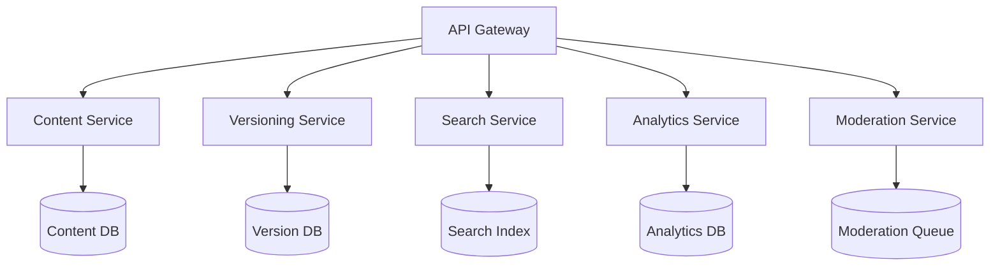
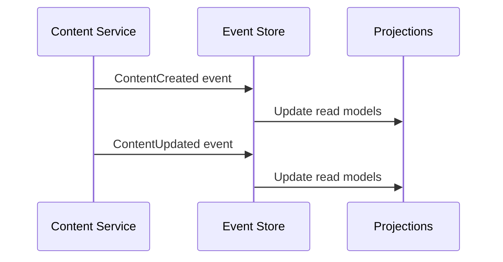
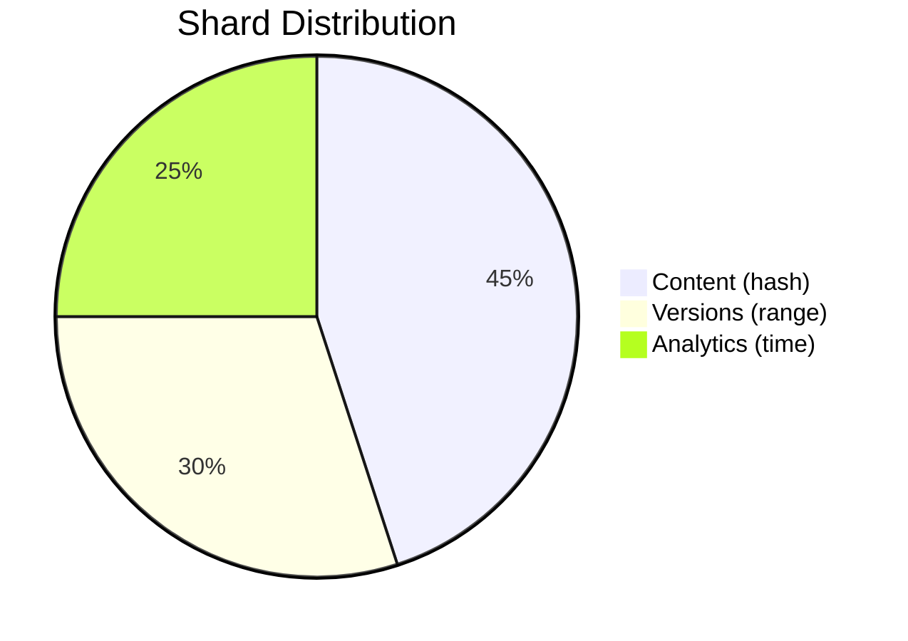

# CMS Performance Optimization Architecture

## 1. Microservices Decomposition Strategy

Key Services to Extract:
- Content Service (CRUD operations)
- Versioning Service (content history/rollback)
- Search Service (indexing and queries)
- Analytics Service (views, engagement)
- Moderation Service (approval workflows)

Migration Steps:
1. Identify bounded contexts from current monolith
2. Create service contracts/interfaces
3. Implement facade pattern for gradual migration
4. Extract services one at a time starting with most independent

## 2. Event Sourcing Implementation Plan

Implementation Approach:
1. Add event store (Kafka/EventStoreDB)
2. Modify write operations to emit events
3. Build projections for read models
4. Implement event replay for recovery
5. Add versioning to event schema

## 3. Database Sharding Approach

Sharding Strategy:
- **Content Sharding**: By category ID (hash-based)
- **Version Sharding**: By content ID (range-based)
- **Analytics Sharding**: By date (time-based)

Migration Roadmap:
1. Implement sharding proxy layer
2. Add shard routing logic
3. Migrate data gradually using dual-write
4. Implement cross-shard queries

## Risk Assessment

| Risk | Mitigation Strategy |
|------|---------------------|
| Service communication overhead | Implement circuit breakers, caching |
| Event schema evolution | Version events, backward compatibility |
| Shard imbalance | Dynamic rebalancing, monitoring |
| Distributed transactions | Saga pattern, eventual consistency |