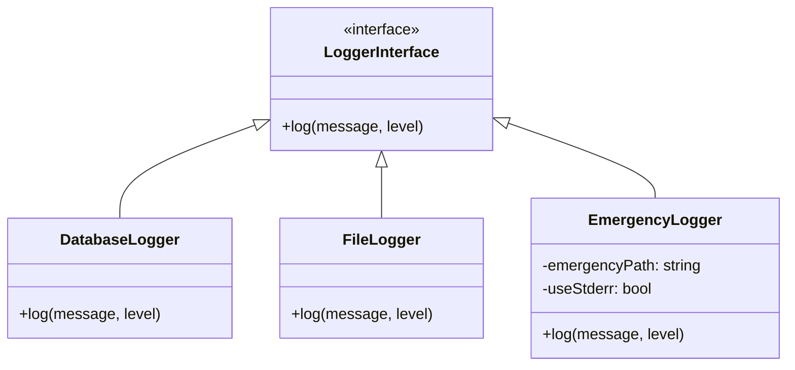
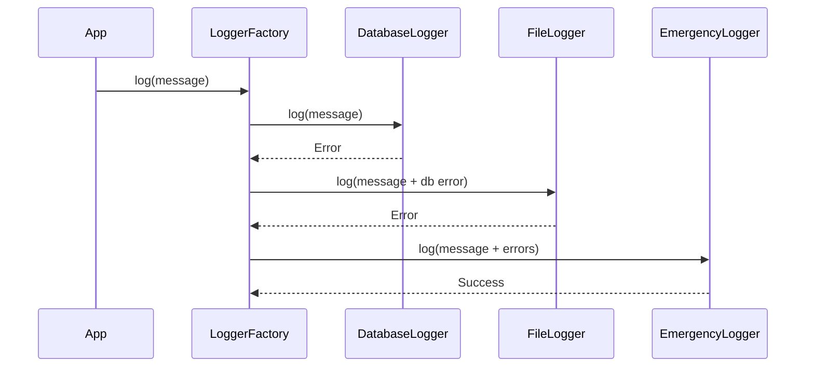

# Logger Fallback Mechanism Design

## Overview
Enhanced error handling with cascading fallback:
1. Primary: DatabaseLogger
2. Secondary: FileLogger 
3. Emergency: EmergencyLogger (stderr + emergency.log)

## Class Diagram


## Error Escalation Sequence


## Implementation Details

### Failure Detection
1. **DatabaseLogger**:
```php
try {
    $this->db->insert($logEntry);
} catch (PDOException $e) {
    throw new LoggerException("Database write failed");
}
```

2. **FileLogger**:
```php
if (!is_writable($this->path)) {
    throw new LoggerException("File not writable");
}

$handle = @fopen($this->path, 'a');
if ($handle === false) {
    throw new LoggerException("File open failed");
}
```

### Configuration
```php
LoggerFactory::configure([
    'emergency' => [
        'path' => 'logs/emergency.log', // Required
        'use_stderr' => true, // Optional
        'notify_admin' => false // Optional
    ]
]);
```

## Testing Requirements
1. Verify all fallback scenarios
2. Test file permission failures
3. Test database connection failures
4. Verify emergency.log creation
5. Test stderr output when enabled