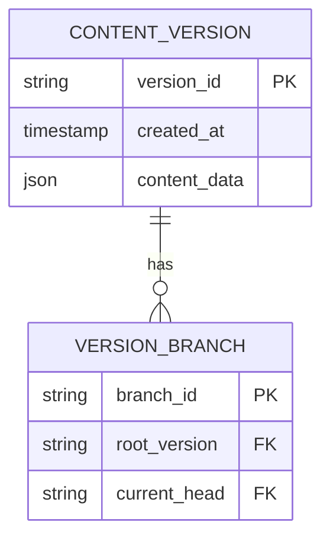

# Content Version Branching System (v2.5)

## Architecture Overview


## Implementation Phases

### 1. Database Modifications
### 2. API Endpoints
- `POST /api/versions/:id/branch` - Create new branch
- `GET /api/branches` - List available branches
- `POST /api/branches/:id/merge` - Merge branch changes

### 3. Frontend Components
- BranchSwitcher.vue: Dropdown for branch selection
- MergeConflictResolver.vue: Interface from existing ConflictResolver
- VersionTimeline.vue: Extended to show branch forks

### Integration Sequence:
1. Editor requests branch creation
2. System duplicates version tree
3. Editor receives new branch context
4. All changes isolated to branch
5. Merge operations mergeNonConflicting changes
```php
// New migration to add branching
Schema::table('content_versions', function (Blueprint $table) {
    $table->string('branch_id')->nullable()->after('id');
    $table->foreign('branch_id')->references('id')->on('version_branches'); 
});

Schema::create('version_branches', function (Blueprint $table) {
    $table->string('id')->primary();
    $table->string('name');
    $table->string('root_version_id');
    $table->foreign('root_version_id')->references('id')->on('content_versions');
});
```

(Content continues...)