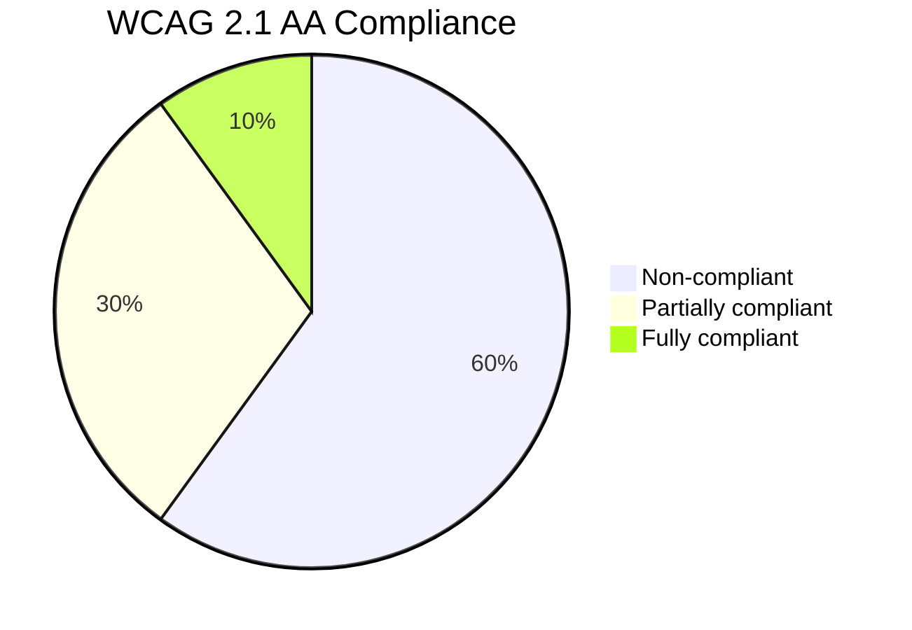
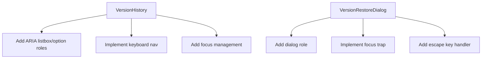

# Version Comparison Accessibility Audit Report

## Findings Summary

### Critical Issues
1. **Keyboard Navigation**
   - No keyboard support for version selection
   - No focus management in dialogs
   - Missing tabindex and keyboard event handlers

2. **Screen Reader Compatibility**
   - Missing ARIA roles (listbox, option, dialog)
   - No live regions for dynamic content
   - Unlabeled interactive elements

3. **Color Contrast**
   - Diff highlighting colors fail contrast ratios
   - Notification colors need verification

4. **ARIA Implementation**
   - Missing aria-selected for version items
   - No aria-live for loading states
   - Missing aria-modal for dialogs

## Prioritized Remediation Plan

### Phase 1: Critical Fixes (1-2 days)
1. **Keyboard Navigation**
   - Add tabindex to version list items
   - Implement arrow key navigation
   - Add focus trapping for dialogs

2. **Screen Reader Support**
   - Add ARIA roles to version list
   - Implement live regions for notifications
   - Add aria-labels to buttons

### Phase 2: Visual Improvements (1 day)
1. **Color Contrast**
   - Adjust diff highlight colors
   - Add high contrast mode
   - Verify notification colors

2. **Focus States**
   - Add visible focus indicators
   - Improve button focus styles

### Phase 3: Enhanced Support (2-3 days)
1. **ARIA Attributes**
   - Add aria-selected to versions
   - Implement aria-modal for dialogs
   - Add error boundary roles

2. **Testing**
   - Screen reader testing
   - Keyboard navigation testing
   - Color contrast verification

## Implementation Recommendations

1. **Component Updates**

2. **CSS Improvements**
- Add `:focus-visible` styles
- Adjust color contrast ratios
- Add forced colors media query

3. **Testing Strategy**
- Automated axe-core tests
- Manual screen reader testing
- Keyboard navigation testing