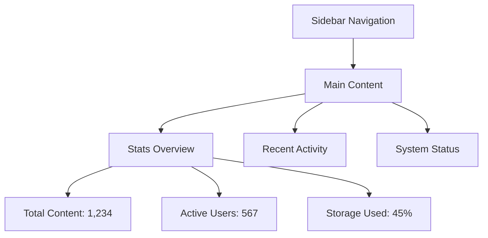
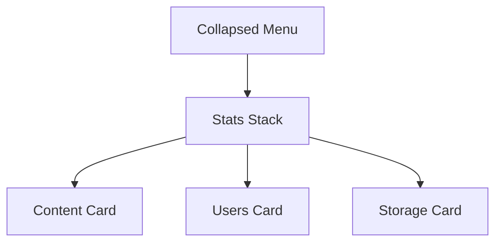
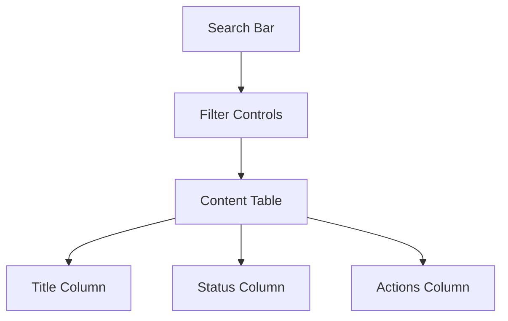
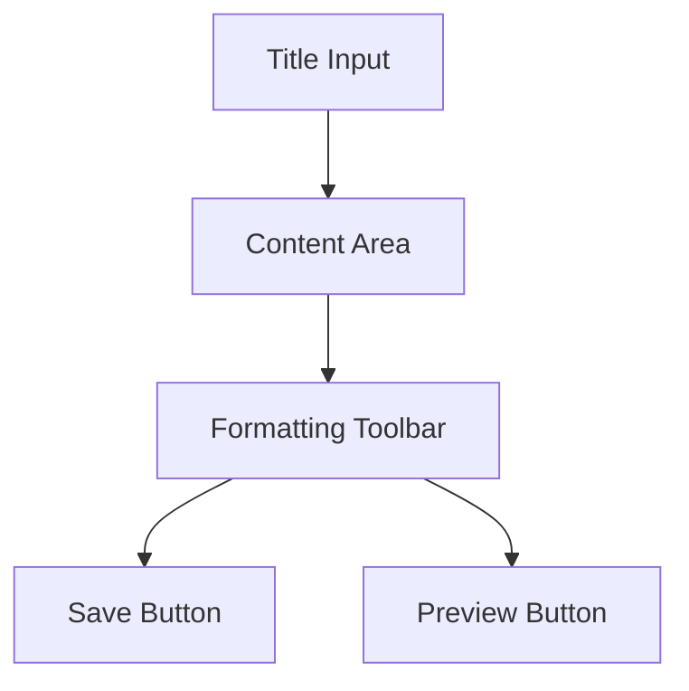
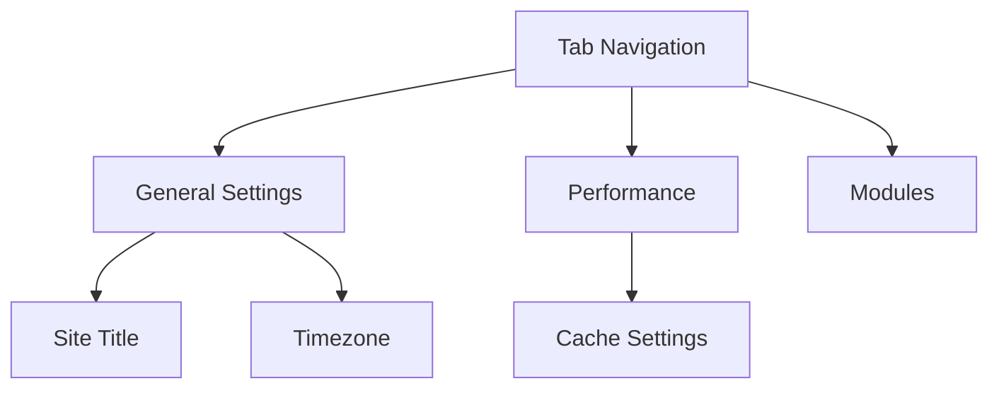
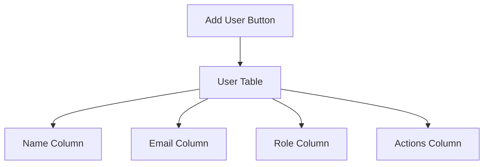
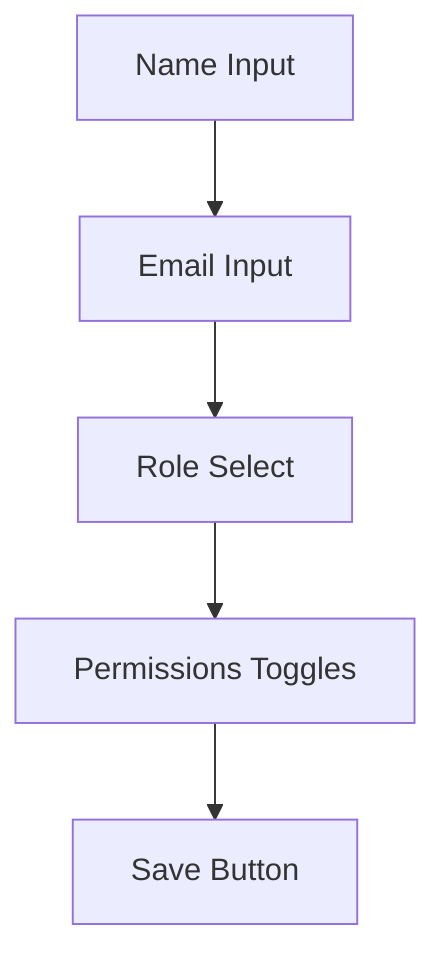
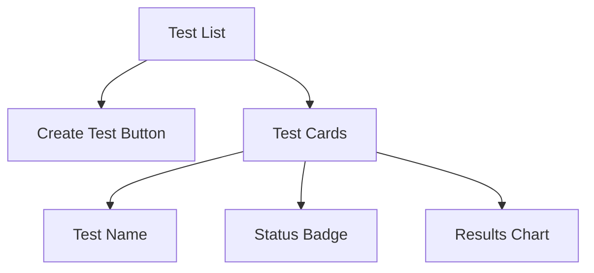
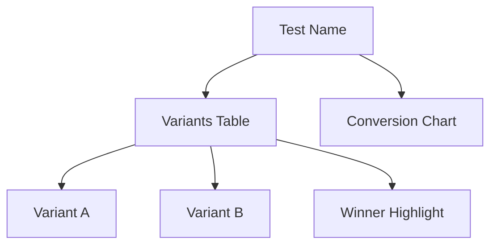

# Admin Panel Mockups

## Dashboard Layout
### Desktop

### Mobile

## Content Management
### Content List

### Content Editor

## System Configuration
### Settings Page

## User Administration
### User List

### User Form

## A/B Testing
### Test Overview

### Test Details

## Responsive Behavior
- Sidebar collapses to hamburger menu on mobile
- Tables switch to card views on small screens
- Forms stack vertically on mobile
- Charts resize proportionally