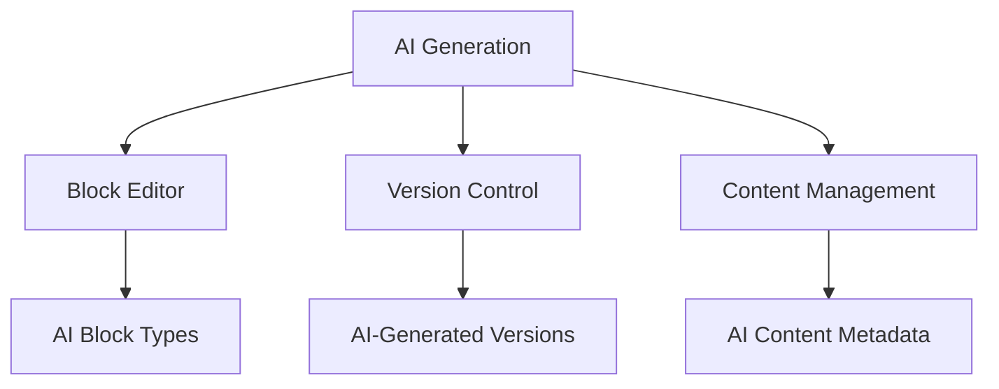
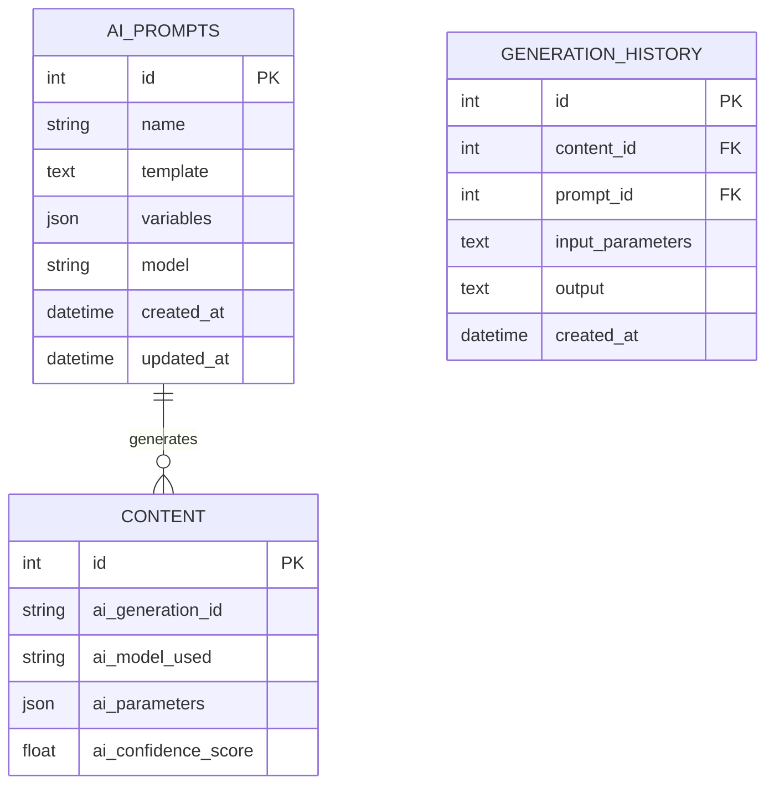
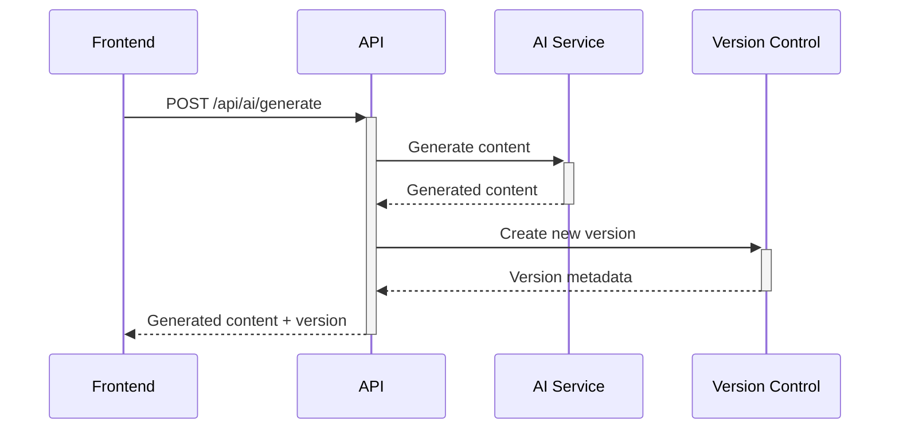
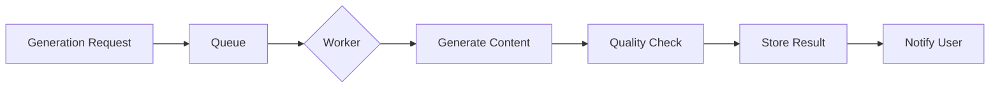
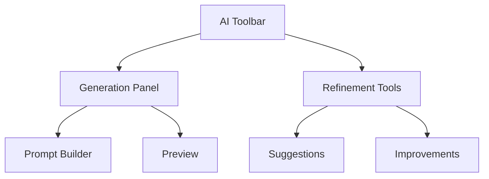

# AI Content Generation System Architecture

## 1. Integration with Existing CMS Components



- **Block Editor Integration**:
  - New AI block types (text, image, layout suggestions)
  - Inline generation controls within existing blocks
  - AI-assisted editing tools

- **Version Control**:
  - Track AI-generated versions separately
  - Mark auto-generated content in version history
  - Special merge handling for AI-assisted edits

- **Content Management**:
  - AI content metadata tracking
  - Generation source attribution
  - Quality scoring system

## 2. Database Changes



## 3. API Endpoints



## 4. Background Processing



## 5. Frontend Components



## 6. Security Considerations

```mermaid
graph LR
    A[Content Moderation] --> B[Pre-Generation]
    A --> C[Post-Generation]
    D[Usage Limits] --> E[Rate Limiting]
    D --> F[Quotas]
    G[Audit Logging] --> H[Full Traceability]