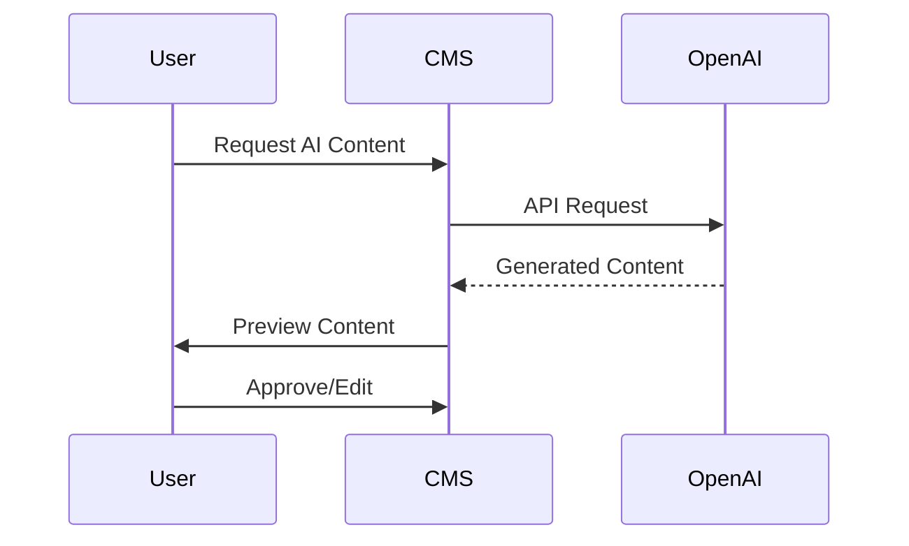

# AI Content Generation Integration

## Overview
The CMS integrates with OpenAI's API to provide AI-assisted content generation capabilities, including:
- Article drafting
- Image generation
- Content suggestions
- SEO optimization



## API Endpoints

### Generate Text Content
```php
// routes/api/ai.php
Route::post('/generate/text', function (Request $request) {
    $validated = $request->validate([
        'prompt' => 'required|string',
        'tone' => 'in:professional,casual,technical',
        'length' => 'integer|min:50|max:2000'
    ]);

    $response = OpenAI::completions()->create([
        'model' => 'gpt-4',
        'prompt' => $request->prompt,
        'max_tokens' => $request->length,
        'temperature' => 0.7
    ]);

    return response()->json([
        'content' => $response->choices[0]->text,
        'usage' => $response->usage
    ]);
});
```

## Prompt Management
Prompts are stored in the `ai_prompts` table with versioning:

```php
// database/migrations/2025_04_27_143256_create_ai_prompts_table.php
Schema::create('ai_prompts', function (Blueprint $table) {
    $table->id();
    $table->string('name');
    $table->text('template');
    $table->json('variables');
    $table->foreignId('content_type_id');
    $table->timestamps();
});
```

## Content Generation Workflow
1. User selects content type and prompt
2. System applies template with variables
3. AI processes request
4. Generated content returns for review
5. User can:
   - Accept as-is
   - Regenerate
   - Edit manually

## Example Implementation
```javascript
// Frontend component
async function generateContent() {
    const response = await fetch('/api/ai/generate/text', {
        method: 'POST',
        body: JSON.stringify({
            prompt: 'Write a blog intro about AI content generation',
            tone: 'professional',
            length: 200
        })
    });
    
    const data = await response.json();
    editor.setContent(data.content);
}
```

## Configuration
Set in `config/openai.php`:
```php
return [
    'api_key' => env('OPENAI_API_KEY'),
    'default_model' => 'gpt-4',
    'rate_limit' => 30, // requests per minute
    'content_filters' => [
        'profanity' => true,
        'bias' => true
    ]
];
```

## Best Practices
- Always review AI-generated content
- Set clear character limits
- Implement content validation
- Monitor API usage costs