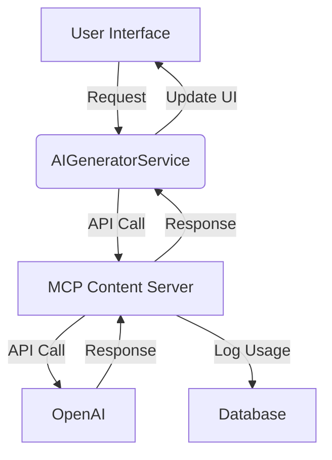

# AI Content Generation System Architecture

## Overview
The AI content generation system consists of several components working together:

## Components

### 1. Frontend (User Interface)
- Built with Vue.js components
- Uses AIGeneratorService for API communication
- Provides templates and prompt management UI

### 2. AIGeneratorService
- Handles content generation requests
- Manages templates and formatting
- Tracks usage and credits
- Error handling and retries

### 3. MCP Content Server
- API gateway for OpenAI requests
- Rate limiting and usage tracking
- Content moderation and validation
- Response caching

### 4. OpenAI Integration
- Uses GPT models for content generation
- Configurable parameters (temperature, max_tokens)
- Cost tracking per request

### 5. Database
- Stores usage statistics
- Tracks user quotas
- Logs generation history