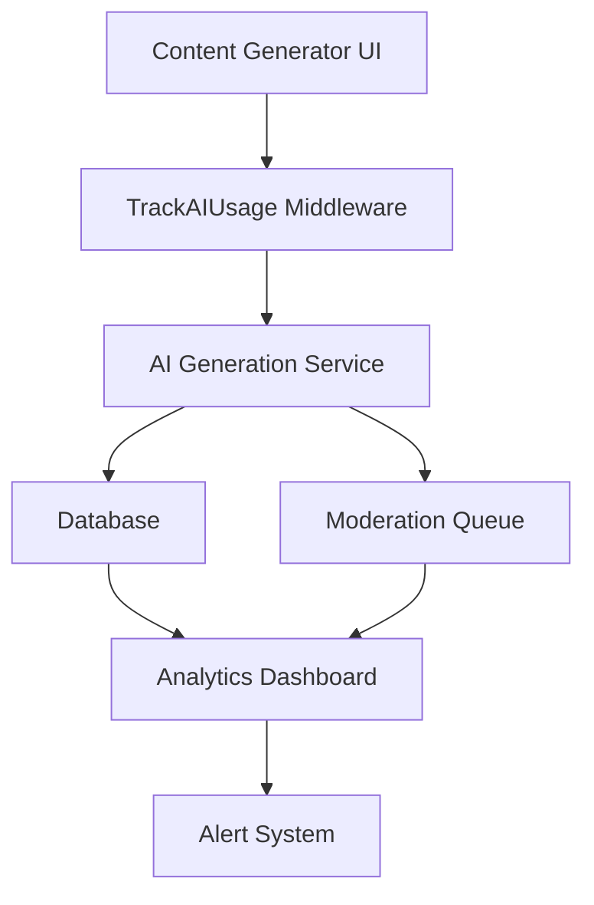
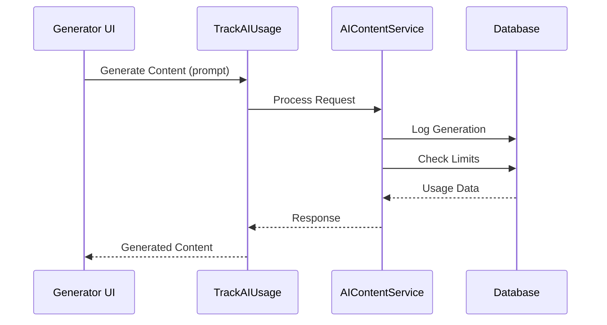

# AI Content Generation Monitoring System

## System Architecture


## Database Schema Updates
### New Table: ai_content_generations
```sql
CREATE TABLE ai_content_generations (
    id BIGINT PRIMARY KEY AUTO_INCREMENT,
    user_id BIGINT REFERENCES users(id),
    prompt TEXT,
    generated_content TEXT,
    tokens_used INT,
    quality_score DECIMAL(3,2),
    cost DECIMAL(10,2),
    moderation_status ENUM('pending','approved','rejected'),
    moderation_metadata JSON,
    created_at TIMESTAMP,
    updated_at TIMESTAMP
);
```

### Users Table Updates
```sql
ALTER TABLE users
ADD COLUMN monthly_token_limit INT DEFAULT 100000,
ADD COLUMN monthly_token_usage INT DEFAULT 0,
ADD COLUMN quality_score_threshold DECIMAL(3,2) DEFAULT 0.7;
```

## API Specifications


## Implementation Steps
1. Create database migrations
2. Enhance TrackAIUsage middleware
3. Update AIContentService
4. Build analytics dashboard
5. Implement alert system
6. Add billing integration

## UI Components
- Usage Trends Dashboard
- Cost Analysis Reports
- Quality Metrics Visualization
- Moderation Statistics
- Alert Configuration Panel