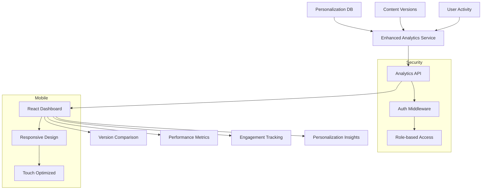

# Analytics Dashboard Architecture Plan

## Overview
Enhanced analytics dashboard focusing on:
- Real-time version comparison metrics
- Content performance visualization  
- User engagement tracking
- Personalization database integration

## Architecture Diagram

## Key Components

### 1. Enhanced Analytics Service
- Real-time metrics processing
- Version comparison engine
- Personalization data integration
- Caching layer for performance

### 2. Database Tables
- `version_analytics_enhanced` (detailed metrics)
- `content_performance` (engagement tracking)  
- `personalization_metrics` (personalization DB connection)

### 3. React Dashboard Components
- Version comparison visualization
- Performance trend graphs  
- User engagement heatmaps
- Personalization impact charts

### 4. API Endpoints
- GET /api/analytics/versions/comparison
- GET /api/analytics/content/performance
- GET /api/analytics/user/engagement  
- GET /api/analytics/personalization

## Implementation Phases

1. **Backend Foundation (2 weeks)**
   - Create database tables
   - Build analytics service
   - Implement API endpoints

2. **Frontend Development (3 weeks)**
   - Build React components
   - Implement visualizations
   - Mobile responsiveness

3. **Integration & Testing (1 week)**
   - Connect to personalization DB
   - Performance testing
   - Security review

4. **Deployment (1 week)**
   - Staging testing
   - Gradual rollout
   - Monitoring setup