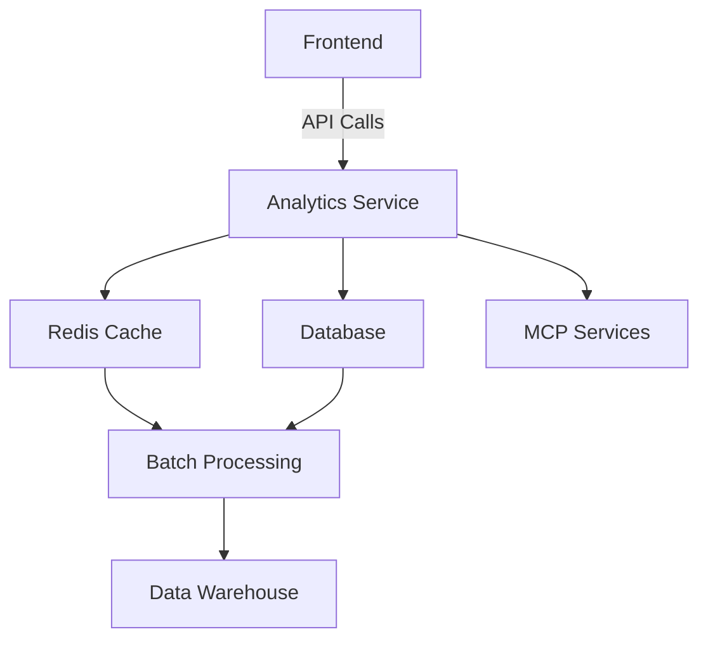
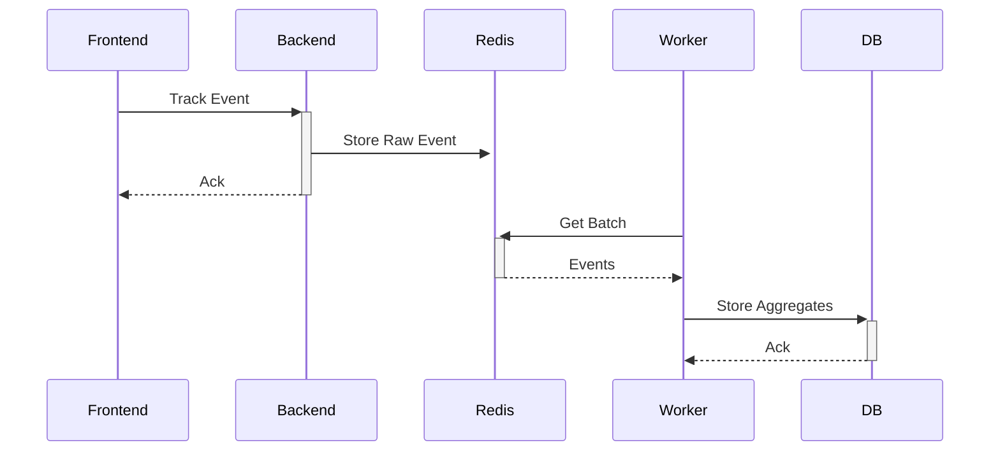

# Analytics Dashboard Architecture Plan

## 1. System Overview
- **Purpose**: Comprehensive user and content analytics
- **Components**: Frontend dashboard, API services, data processing
- **Tech Stack**: Laravel, Vue.js, Chart.js, Redis

## 2. Architecture Diagram

## 3. Key Metrics
- **User Engagement**:
  - Page views
  - Time spent
  - Bounce rate
- **Content Performance**:
  - Views by content type
  - Version comparisons
  - Restoration frequency

## 4. Implementation Phases

### Phase 1: Core Tracking (2 weeks)
- Implement base metrics collection
- Create dashboard framework
- Basic visualizations

### Phase 2: Content Analytics (2 weeks)
- Content-specific tracking
- Advanced filters
- Export functionality

### Phase 3: Optimization (1 week)
- Performance tuning
- Caching strategy
- User permissions

## 5. Data Flow

## 6. Error Handling
- Retry mechanism for failed events
- Data validation
- Fallback storage