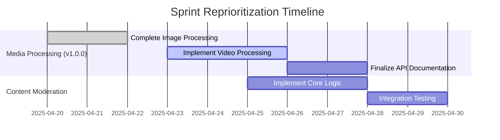

# Architectural Reprioritization Plan (April 2025)

## Priority Changes
1. **Focus Areas**:
   - Complete Media Processing service (v1.0.0)
   - Implement video processing features
   - Finalize content moderation integration

2. **Paused Work**:
   - Search Enhancement service development
   - All non-critical Content Generation service updates

## Implementation Plan

## Detailed Tasks

### Media Processing Service
1. Complete video processing endpoint
   - Support MP4, MOV, WebM formats
   - Implement thumbnail generation
   - Add compression options
   - Redis queue integration

2. Finalize v1.0.0 features
   - API documentation
   - Error handling
   - Status tracking

### Content Moderation
1. Priority scoring system
2. Batch processing workflow
3. Moderator notes system
4. Automated triage rules

### Search Enhancement Pause
1. Document current state
2. Create branch point
3. Update sprint board

## Maintenance Items
- Content Generation service monitoring
- Critical bug fixes only