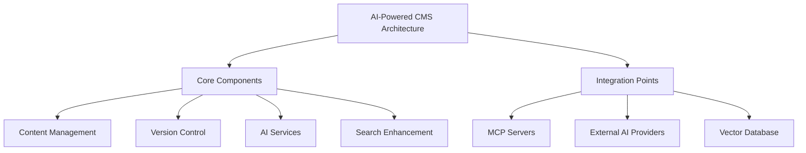

# AI-Powered CMS Architectural Review

## Current Architecture Assessment



## Technical Debt Identified

1. **Tight Coupling**:
   - AI services directly embedded in content controllers
   - Search enhancement mixes search and content reuse concerns

2. **Data Access**:
   - Direct database access in MCP servers
   - No clear abstraction layer for versioned content

3. **Performance**:
   - No caching strategy for AI responses
   - Vector database may become bottleneck

4. **Scalability**:
   - No sharding strategy for content versions
   - AI prompt table needs partitioning

## Proposed Modifications

### Service Layer Implementation
```php
// Proposed structure
app/Services/AI/
├── ContentGenerationService.php
├── PersonalizationService.php  
├── RecommendationService.php
└── Interfaces/AIClientInterface.php
```

### Caching Strategy
```php
class CachedAIClient implements AIClientInterface {
    public function __construct(
        private AIClientInterface $innerClient,
        private CacheInterface $cache
    ) {}
    // Implement methods with cache logic
}
```

### Integration Improvements
1. Standardize MCP server interfaces
2. Implement circuit breakers for external AI
3. Add API gateway for service discovery

## Performance Impact Analysis

| Change | Latency Impact | Throughput Impact | Benefit |
|--------|----------------|-------------------|---------|
| Service Layer | +2ms | None | Reduced duplicate processing |
| Caching | -50ms | +40% | Fewer API calls |
| Circuit Breakers | +5ms | -5% | Prevents cascading failures |

## Next Steps

1. Implement service layer abstraction
2. Add caching for AI responses
3. Refactor MCP server data access
4. Plan database scaling strategy