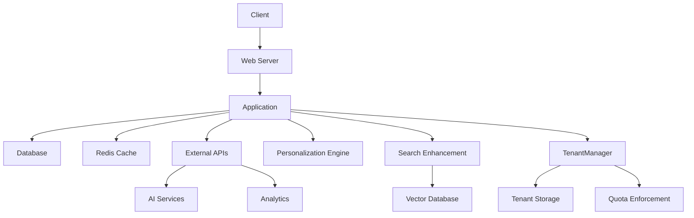
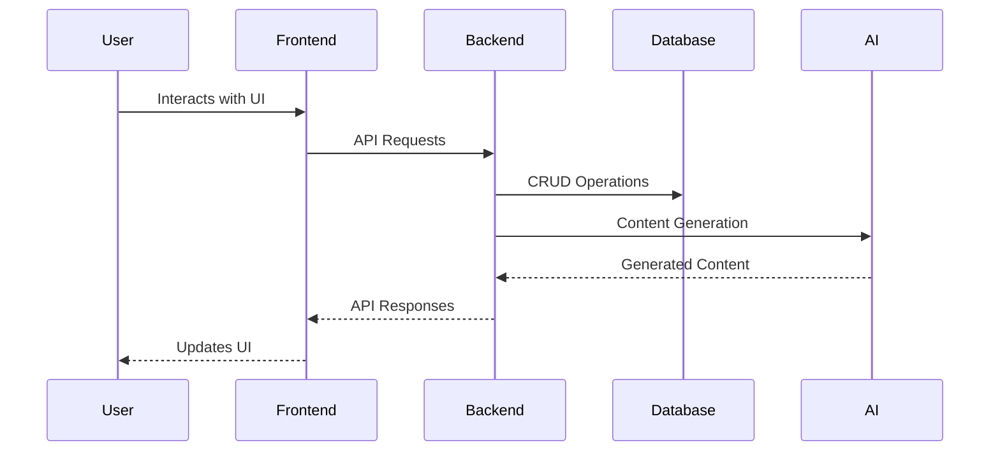
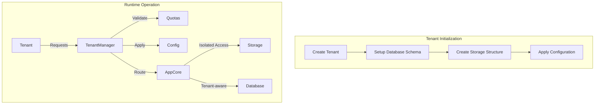

# System Architecture

## Overview
The CMS is built as a custom PHP application with a modular architecture and clear separation between:
- Presentation layer (Views/Components)
- Application layer (Controllers/Services)
- Domain layer (Models/Repositories)
- Infrastructure layer (Database/External Services)

## Core Components

## Data Flow

## Key Technologies
- **Backend**: PHP 8.2, Custom Framework
- **Frontend**: Vanilla JS, Custom Components
- **Database**: MySQL 8, Redis
- **Search**: Custom Search Implementation
- **AI Integration**: OpenAI API
- **Analytics**: Custom Analytics System
- **Personalization**: MCP Personalization Engine
- **Search Enhancement**: MCP Search Service

## Multi-Tenant Architecture

The system implements comprehensive tenant isolation through:

- **TenantManager**: Central service for tenant configuration
  - Schema-per-tenant database isolation
  - Automated tenant initialization
- **Isolated Storage**: Dedicated storage paths per tenant
  - `/storage/tenants/{tenant_id}/` structure
- **Quota Enforcement**: Resource limits per tenant
  - Storage quota monitoring
  - Request rate limiting

## Deployment
The system is deployed via FTP with:
- Web servers (Apache/Nginx)
- Database servers
- Scheduled tasks via cron