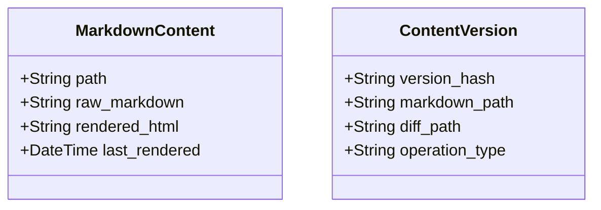

# CMS Architecture for Shared Hosting

## Core Requirements
- Compatible with shared hosting environments
- Efficient markdown content storage and rendering
- Minimal database dependencies
- Optimized version control system

## Content Storage Design


## Version Control System
- Store versions as markdown diffs
- Flat file storage for version history
- Optimized comparison operations
- Lightweight database for metadata only

## API Endpoints
```
/api
  /v1
    /markdown
      POST /render
      GET /{id}
      GET /{id}/versions
    /version-control
      POST /compare
      POST /restore
```

## Performance Considerations
- Cached markdown rendering
- Batch version operations
- Minimal database writes
- File-based caching