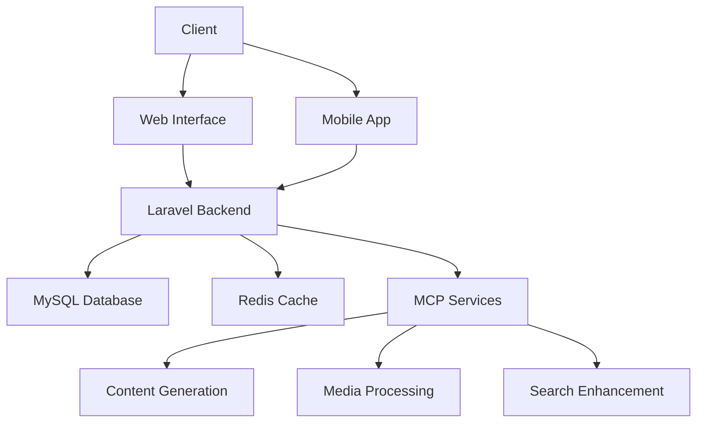

# System Architecture

## Technology Stack

### Backend
- **Framework**: Laravel 10.x
- **API Authentication**: Laravel Sanctum
- **Caching**: Redis
- **Queue**: Laravel Horizon

### Frontend
- **Primary**: Livewire/Alpine.js
- **Complex UIs**: Vue.js 3
- **CSS**: Tailwind CSS

### Database
- **Primary**: MySQL 8.0+
- **Search**: MCP Search Enhancement service

### Infrastructure
- PHP 8.2+
- Node.js 18+ for asset compilation
- Supervisor for queue workers

## Data Flow
1. Client requests processed through Laravel routes
2. Controllers handle business logic
3. Models interact with database
4. Responses formatted via API Resources
5. Complex operations delegated to MCP services
6. Results cached in Redis where appropriate