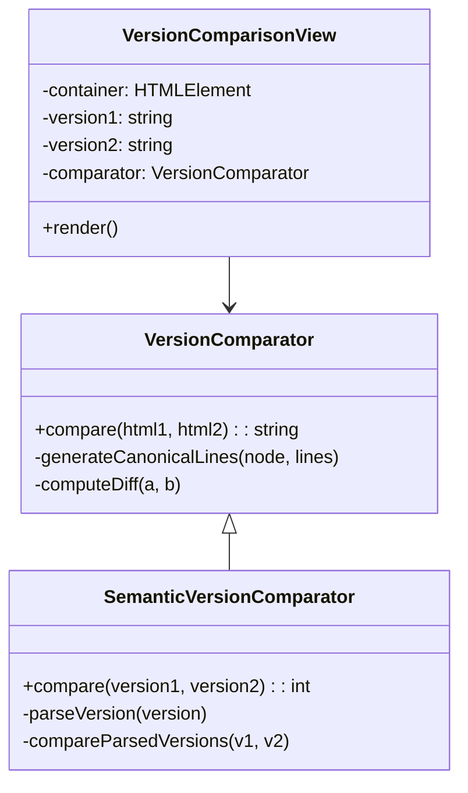

# Version Comparison Architecture

## Component Diagram

## Core Components

### VersionComparator
- **Purpose**: Compare HTML content versions
- **Methods**:
  - `compare(html1, html2)`: Returns unified diff string
  - `generateCanonicalLines()`: Normalizes HTML structure
  - `computeDiff()`: Implements diff algorithm

### SemanticVersionComparator
- **Purpose**: Compare semantic version strings
- **Methods**:
  - `compare(version1, version2)`: Returns -1, 0, or 1
  - `parseVersion()`: Validates and extracts version parts
  - `comparePrereleases()`: Handles prerelease versions

### VersionComparisonView
- **Purpose**: Render comparison UI
- **Methods**:
  - `render()`: Displays diff output in container

## Data Flow
1. User provides two versions (HTML or semantic)
2. Frontend passes versions to appropriate comparator
3. Comparator processes and returns diff
4. View renders formatted output

## Error Handling
- Invalid HTML: Silently handled with `@` error suppression
- Invalid versions: Throws `Exception` with descriptive message