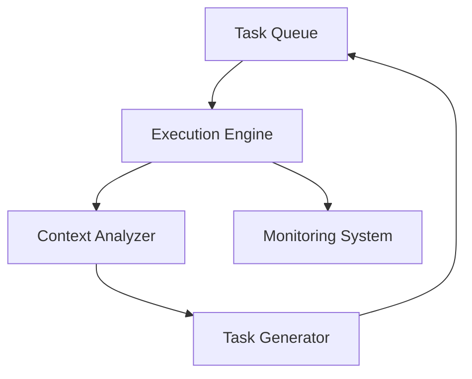

# Autonomous Behavior Model Implementation Plan

## Core Architecture

## Component Specifications

### 1. Task Execution Engine
- Immediate execution of 'run' commands
- State persistence between tasks
- Atomic operation guarantees
- Timeout handling (default: 5 minutes per task)

### 2. Context Analyzer
- Project state assessment:
  - File system changes
  - Git status
  - Running processes
- Dependency mapping
- Next task prediction algorithm

### 3. Autopilot Controller
- Continuous operation loop
- Priority-based task selection:
  - Critical fixes (errors)
  - Feature implementation
  - Optimization
  - Maintenance
- Resource monitoring:
  - CPU/Memory usage
  - Disk space
  - Network connectivity

### 4. Safeguards
- Error rate limiting (max 3 failures/hour)
- Deadlock detection (task duration monitoring)
- Automatic rollback protocol
- Heartbeat monitoring

### 5. Monitoring System
- JSON-based execution logs
- Performance metrics dashboard
- Progress reporting:
  - Tasks completed
  - Current objectives
  - Estimated completion

## Implementation Phases

1. **Phase 1**: Core Engine (2 weeks)
   - Basic task execution
   - State management
   - Error handling

2. **Phase 2**: Autopilot (3 weeks)
   - Context analysis
   - Task generation
   - Continuous operation

3. **Phase 3**: Safeguards (1 week)
   - Rate limiting
   - Recovery protocols
   - Monitoring

4. **Phase 4**: Integration (1 week)
   - Existing codebase adaptation
   - Testing
   - Deployment

## Risk Management

| Risk | Mitigation |
|------|------------|
| Infinite loops | Max iterations per task |
| Resource exhaustion | Automatic throttling |
| Corrupted state | Periodic snapshots |
| Unintended changes | Change confirmation |