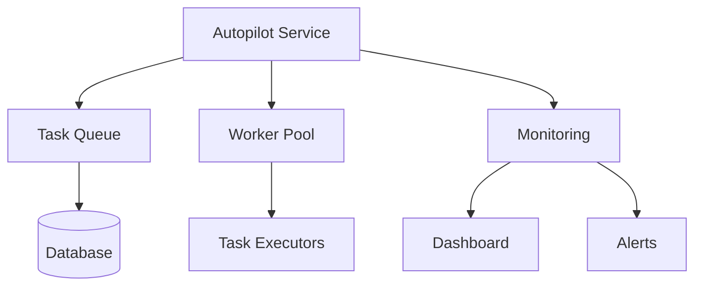

# Autopilot Redesign Plan

## Core Architecture



## Phase 1 Implementation

1. **Task Queue Table**:
```php
Schema::create('autopilot_tasks', function (Blueprint $table) {
    $table->id();
    $table->string('name');
    $table->text('payload')->nullable();
    $table->string('status')->default('pending');
    $table->integer('attempts')->default(0);
    $table->timestamp('available_at');
    $table->timestamps();
});
```

2. **Base Service Class**:
```php
class AutopilotService {
    protected function dispatchTask(string $name, array $payload = []): void {
        AutopilotTask::create([
            'name' => $name,
            'payload' => json_encode($payload),
            'available_at' => now()
        ]);
    }

    protected function processNextTask(): void {
        $task = AutopilotTask::where('available_at', '<=', now())
            ->where('status', 'pending')
            ->orderBy('available_at')
            ->first();
            
        if ($task) {
            $this->executeTask($task);
        }
    }
}
```

## Next Steps

1. Create database migration
2. Implement base service class
3. Add monitoring hooks
4. Implement worker process
5. Create dashboard view

Would you like me to proceed with implementing Phase 1?
## Phase 2: Resilience Implementation

### Key Components:
1. **Task Retry System**:
   - Automatic retry of failed tasks
   - Exponential backoff
   - Max attempt limits

2. **Monitoring Dashboard**:
   - Real-time queue status
   - Worker health metrics
   - Task execution history

3. **Recovery Mechanisms**:
   - Dead letter queue for unrecoverable tasks
   - Manual task restart capability
   - System health checks

4. **Implementation Timeline**:
   - Week 1: Retry system and dead letter queue
   - Week 2: Monitoring dashboard
   - Week 3: Health checks and alerts
## Monitoring Dashboard Design

### Components:
1. **Queue Status Panel**:
   - Active workers count
   - Pending/Processing/Failed tasks
   - Queue depth metrics

2. **Task History**:
   - Recent task executions
   - Success/failure rates
   - Average processing times

3. **System Health**:
   - Server resource usage
   - Database connections
   - External service status

4. **Implementation Approach**:
   - Livewire components for real-time updates
   - Redis-backed metrics collection
   - Daily/weekly summary reports