# Chunked Version Control System Deployment Plan

## Overview
Plan for deploying the chunked version control system to staging with requirements:
1. Deployment planning
2. Database migration
3. Code deployment
4. Monitoring setup
5. Documentation updates

```mermaid
graph TD
    A[Deployment Plan] --> B[1. Deployment Planning]
    A --> C[2. Database Migration]
    A --> D[3. Code Deployment]
    A --> E[4. Monitoring Setup]
    A --> F[5. Documentation]
    
    B --> B1[✔ Verify API endpoints]
    B --> B2[✔ Check auth compatibility]
    B --> B3[Plan rollback procedure]
    
    C --> C1[Backup production data]
    C --> C2[Prepare schema changes]
    C --> C3[Create migration scripts]
    
    D --> D1[Deploy API endpoints]
    D --> D2[Deploy frontend components]
    D --> D3[Verify version compatibility]
    
    E --> E1[Configure chunk metrics]
    E --> E2[Setup error tracking]
    E --> E3[Health check endpoints]
    
    F --> F1[Update API docs]
    F --> F2[Create rollback guide]
    F --> F3[Document known issues]
```

## Detailed Steps

### 1. Deployment Planning
- Verify API endpoints match client expectations
- Confirm authentication/authorization compatibility
- Rollback procedure:
  - API: Feature flag to disable chunked endpoints
  - Frontend: Conditional rendering fallback
  - Database: Additive changes only

### 2. Database Migration
- Requirements:
  - Add chunk_metadata column to content_versions
  - Create chunk_storage table if needed
- Backup plan:
  - Snapshot content_versions table
  - Export relevant data to JSON

### 3. Code Deployment
- Backend:
  - Deploy new API endpoints:
    - /api/content-diff/chunked-init
    - /api/content-diff/chunk/{n}
  - Add feature flag control
- Frontend:
  - Bundle ChunkedVersionViewer component
  - Add progressive enhancement fallback

### 4. Monitoring Setup
- Key metrics:
  - Chunk load times
  - Chunk cache hit rates
  - Error rates per chunk
- Grafana dashboards:
  - Extend performance-dashboard.json
  - Add chunk-specific panels

### 5. Documentation
- API docs:
  - Add chunked diff endpoints
  - Document request/response formats
- Operational docs:
  - Rollback procedures
  - Monitoring alerts
  - Performance tuning