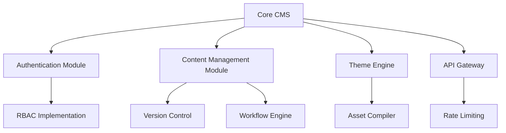
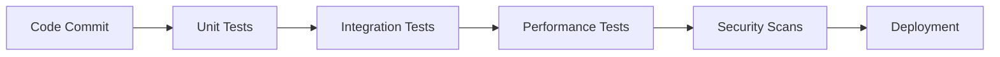
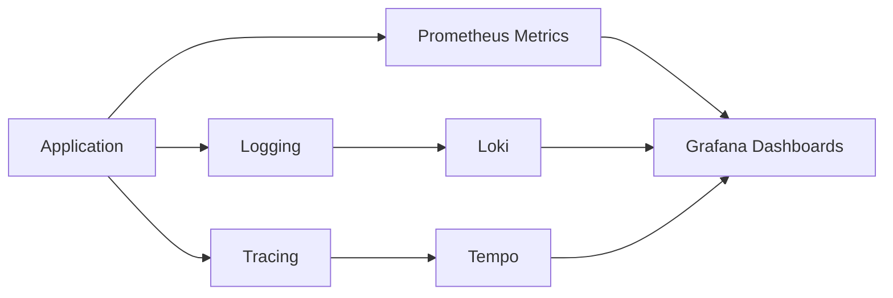

# CMS Architecture 2025

## 1. Modular Component Structure

## 2. Automated Testing Pipeline

## 3. Performance Monitoring Integration

## 4. Security Audit Framework
- OWASP ZAP integration
- Security headers middleware
- Audit logging
- Regular vulnerability scanning
- CSRF protection
- CSP headers

## 5. Scalability Planning
- Kubernetes for horizontal scaling
- Database sharding
- Redis caching
- CDN for static assets
- Queue workers for async processing

## 6. Documentation Standards
- OpenAPI for APIs
- Architecture Decision Records
- Automated code docs
- Markdown user guides
- Developer onboarding docs