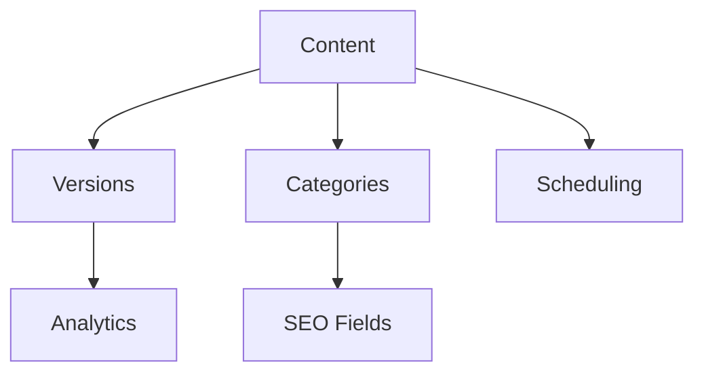

# CMS Development Roadmap - Q2 2025

## Current System Overview

## Prioritized Development Tasks

### 1. Version Analytics Completion (Priority: High)
- **Status**: 80% implemented
- **Components**:
  - Dashboard UI (resources/js/components/VersionAnalyticsDashboard.tsx)
  - API endpoints (routes/version_analytics.php)
  - Data model (database/migrations/2025_04_29_185100_create_version_analytics_table.php)

### 2. Documentation System (Priority: High)

- **Key Files**:
  - docs/technical-specs-v2.md
  - docs/api/*.openapi.yaml
  - docs/implementation-guide.md

### 3. Content Scheduling (Priority: Medium)
- **Existing Routes**:
  - POST /content/{content}/schedules
  - POST /content/{content}/schedules/check-conflicts
- **Enhancements Needed**:
  - Calendar UI integration
  - Timezone support
  - Conflict resolution workflow

### 4. Category SEO (Priority: Medium)
- **Migration Exists**: 2025_04_06_213612_add_seo_fields_to_categories_table.php
- **Implementation Steps**:
  1. Controller methods
  2. Admin UI
  3. Frontend rendering

### 5. Performance Optimization (Priority: Low)
- **Recent Improvements**:
  - Database optimizations (2025_04_27_122400_optimize_database_tables.php)
  - Fulltext search indexes
- **Next Steps**:
  - Query caching
  - Frontend asset optimization