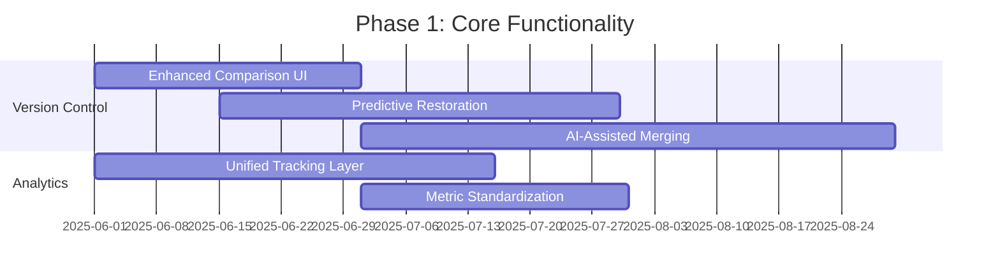

# CMS Development Roadmap

## Phase 1: Core Functionality (Months 1-3)

## Phase 2: Architecture (Months 4-5)
- Microservices for version operations
- Caching layer implementation
- Event-driven analytics pipeline

## Phase 3: Technical Debt (Month 6)
- Migration consolidation
- Query optimization
- Index management

## Phase 4: Features (Ongoing)
- Quarterly feature releases
- Continuous A/B testing
- Progressive rollout strategy

## Success Metrics
- 30% reduction in version load times
- 25% increase in restoration accuracy
- 40% faster comparison operations