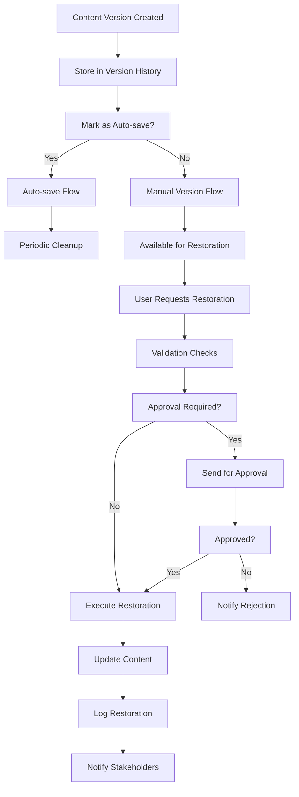
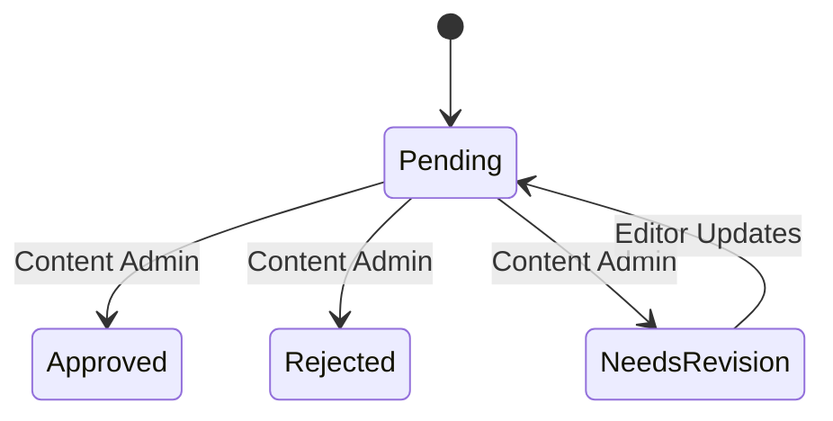
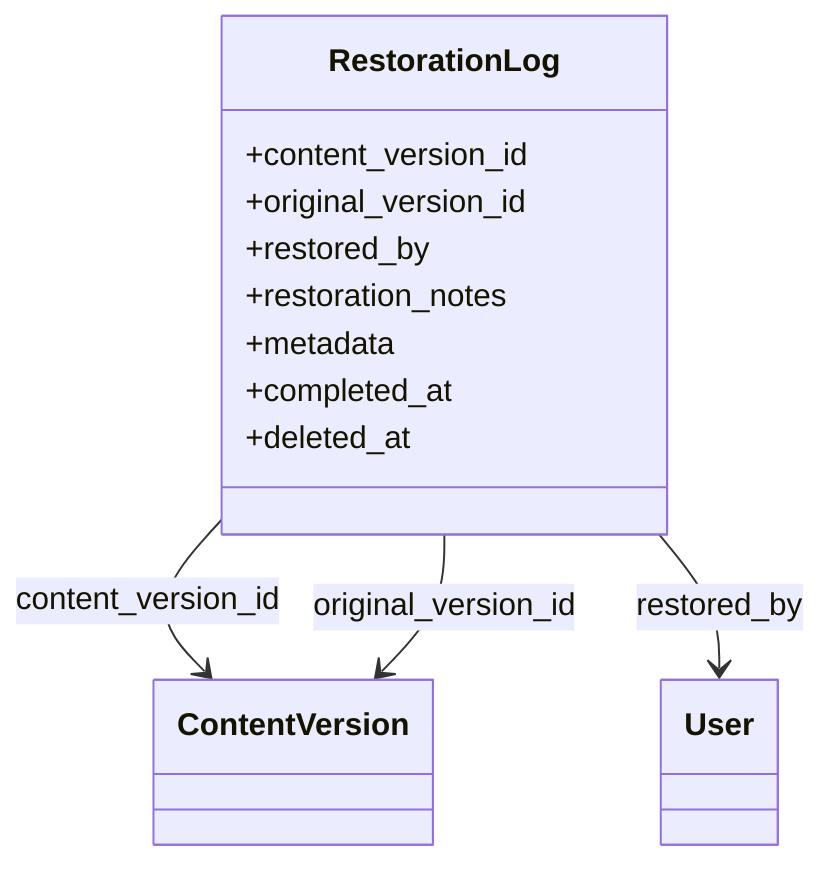
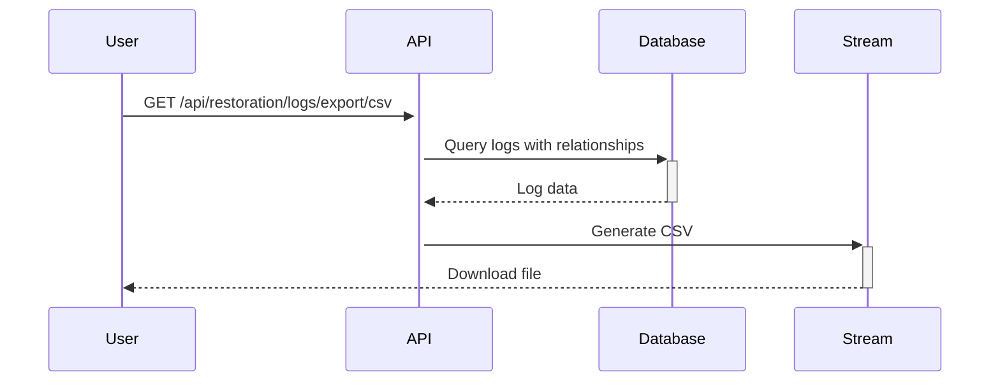

# Automated Content Restoration System Design

## Workflow Diagrams


## Content Validation Requirements
- Schema validation against content_type  
- SEO metadata integrity check  
- Reference integrity (categories, media)  
- AI-generated content watermark verification  
- Change impact analysis  

## Approval System Design


## Notification Requirements
- Email notifications for:
  - Restoration requests
  - Approval decisions  
  - Failed validations
- In-app notifications for:
  - Successful restorations
  - Pending approvals
  - Version comparisons

## Implementation Roadmap
1. **Phase 1: Core Restoration (2 weeks)**
   - Database hooks
   - Version comparison API
   - Basic restoration endpoint

2. **Phase 2: Validation System (1 week)**
   - Content validation service
   - Impact analysis

3. **Phase 3: Approval Workflow (1 week)**
   - Approval queue
   - Decision tracking

4. **Phase 4: Notification System (3 days)**
   - Email templates
   - Webhook integrations

## Restoration Logging System

The RestorationLog model tracks all completed content restorations with:

- **Version Relationships**: Links to both the restored version and original version
- **Audit Trail**: Who performed the restoration and when
- **Metadata**:
  - Restoration method (auto/manual)
  - Number of changes applied
  - Custom notes
- **Soft Deletes**: Preserves history even if log entries are removed



## Export Features

The system provides CSV export of restoration logs with:

- **Full version metadata**: Includes all restoration details
- **Filter capabilities**: Date ranges, content types, users
- **Streaming response**: Efficient for large datasets
- **Authentication required**: Only authorized users can export



## API Endpoints
```
POST /api/restoration/validate
GET /api/restoration/approvals
POST /api/restoration/approve/{id}
POST /api/restoration/reject/{id}
GET /api/restoration/history
POST /api/restoration/execute
GET /api/restoration/logs/export/csv
GET /api/restoration/logs/export/pdf