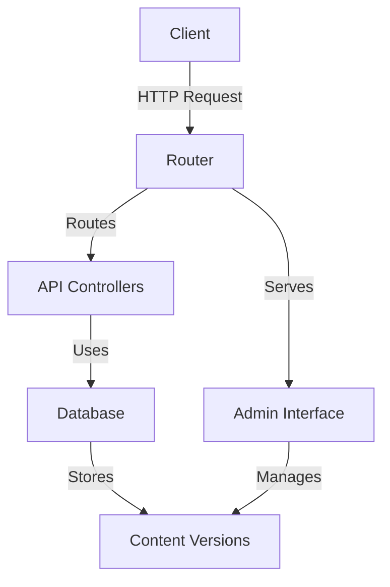

# CMS Core Architecture

## System Overview
Framework-free PHP 8.1+ CMS designed for shared hosting with:
- Custom router implementation
- REST API endpoints
- Version-controlled content storage
- Admin interface

## Key Components

### 1. Router System
Location: `includes/routing/Router.php`

```php
// Example route registration
$router->get('/content', function(Request $request, Response $response) {
    // Route handler logic
});
```

Features:
- HTTP method support (GET, POST, PUT, DELETE)
- Route parameters (`/content/{id}`)
- Middleware pipeline
- Route grouping

### 2. API Structure
Location: `includes/controllers/api/`

Controller pattern:
```php
class ContentController {
    public function show(Request $request, Response $response): void {
        $id = $request->getParam('id');
        $content = Database::getInstance()->fetch('SELECT * FROM contents WHERE id = ?', [$id]);
        $response->json($content);
    }
}
```

### 3. Database Layer
Location: `includes/Database.php`

```php
// Singleton access
$db = Database::getInstance();

// Secure query example
$results = $db->fetchAll(
    'SELECT * FROM contents WHERE status = ?',
    ['published']
);
```

### 4. Admin Interface
Location: `includes/admin/`
- Dashboard
- Content management
- Version control
- System status

## Architecture Diagram


## Implementation Guidelines

### Adding New Routes
1. Create controller in `includes/controllers/`
2. Register route in `includes/routes.php`:
```php
$router->get('/new-route', 'NewController@method');
```

### Database Operations
Always use parameterized queries:
```php
// Good
$db->query('INSERT INTO table (col) VALUES (?)', [$value]);

// Bad - SQL injection risk
$db->query("INSERT INTO table (col) VALUES ('$value')");
```

## File Structure
```
includes/
├── routing/       # Router implementation
├── controllers/   # API controllers
├── Database.php   # Database layer
├── admin/         # Admin interface
└── models/        # Data models