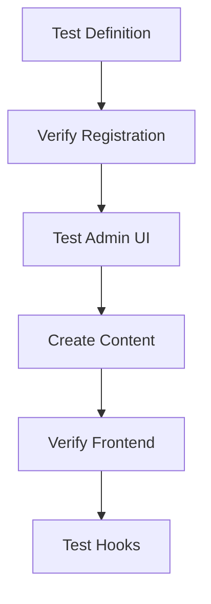

# CPT Builder Module Integration Guide

## 1. JSON Schema Specification

```json
{
  "$schema": "http://json-schema.org/draft-07/schema#",
  "title": "CPT Definition",
  "type": "object",
  "required": ["name"],
  "properties": {
    "name": {
      "type": "string",
      "description": "Machine-readable post type identifier"
    },
    "label": {
      "type": "string",
      "description": "Human-readable label"
    },
    "description": {
      "type": "string"
    },
    "supports": {
      "type": "array",
      "items": {
        "type": "string",
        "enum": ["title", "editor", "thumbnail", "excerpt"]
      }
    },
    "taxonomies": {
      "type": "array",
      "items": {
        "type": "string"
      }
    },
    "fields": {
      "type": "array",
      "items": {
        "$ref": "#/definitions/field"
      }
    }
  },
  "definitions": {
    "field": {
      "type": "object",
      "required": ["type"],
      "properties": {
        "type": {
          "type": "string",
          "enum": ["text", "wysiwyg", "select", "boolean", "media"]
        },
        "label": {
          "type": "string"
        },
        "required": {
          "type": "boolean"
        },
        "options": {
          "type": "array",
          "items": {
            "type": "string"
          }
        },
        "default": {}
      }
    }
  }
}
```

## 2. Hook Points

### Registration Hooks
- `cpt_before_register` - Modify config before registration
  ```php
  add_filter('cpt_before_register', function($config) {
      $config['supports'][] = 'custom-field';
      return $config;
  });
  ```
  
- `cpt_after_register` - Post-registration actions
  ```php
  add_action('cpt_after_register', function($name, $config) {
      // Initialize related taxonomies
  }, 10, 2);
  ```

### Field Rendering Hooks
- `cpt_field_render_[type]` - Custom field rendering
  ```php
  add_filter('cpt_field_render_media', function($html, $field) {
      return custom_media_uploader($field);
  }, 10, 2);
  ```

### Admin Hooks
- `cpt_admin_menu` - Add admin menu items
  ```php
  add_action('cpt_admin_menu', function($name) {
      add_submenu_page('cpt-'.$name, 'Analytics', 'Analytics', 'manage_options', 'cpt-analytics');
  });
  ```

## 3. PageBuilder Field Mappings

| PageBuilder Type | CPT Field Type | Notes |
|-----------------|---------------|-------|
| Text            | text          | Basic text input |
| Rich Text       | wysiwyg       | TinyMCE editor |
| Select          | select        | Requires options array |
| Checkbox        | boolean       | Returns true/false |
| Media           | media         | Attachment ID storage |

## 4. Testing Strategy

### Unit Tests
- Registry operations
- Field validation
- Schema compliance

### Integration Tests
- Admin UI rendering
- Frontend display
- Hook execution

### E2E Tests
1. Create test CPT definition
2. Verify admin interface
3. Create test content
4. Verify frontend rendering
5. Test plugin integration hooks



## 5. FTP Deployment Checklist

- [ ] Verify `/modules/CPT/` directory exists
- [ ] Confirm JSON schema validation
- [ ] Test hook registration
- [ ] Validate field type mappings
- [ ] Run smoke tests:
  - CPT creation
  - Content editing
  - Frontend display
- [ ] Set file permissions:
  - 644 for PHP files
  - 755 for directories