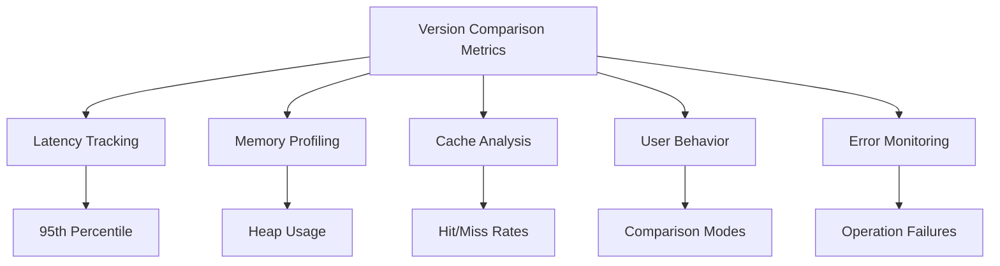

# Version Comparison Dashboard Enhancements

## Current Dashboard Overview
The existing performance dashboard tracks:
- System resources (CPU, memory)
- Application response times and errors
- Database performance
- Basic version control analytics

## Proposed Enhancements

### New Metrics to Add
1. **Comparison Operation Latency**
   - 95th percentile response time
   - Average duration
   - By content type/size

2. **Memory Usage During Diffs**
   - Heap allocation
   - Garbage collection impact
   - Peak memory consumption

3. **Cache Performance**
   - Result cache hit ratio
   - Diff calculation cache efficiency
   - Cache size vs hit rate correlation

4. **User Interaction Metrics**
   - Comparison mode preferences
   - Frequency of comparisons
   - Session duration during comparisons

5. **Error Rates**
   - Version mismatch errors
   - Content parsing failures
   - Timeout occurrences

## Implementation Steps
1. Add new Prometheus metrics:
   - `version_comparison_duration_seconds`
   - `version_diff_memory_bytes`
   - `version_cache_efficiency_ratio`

2. Create new Grafana panels:
   - Comparison latency heatmap
   - Memory usage during operations
   - User interaction funnel

3. Configure alerts:
   - Latency thresholds
   - Memory limits
   - Error rate spikes

## Expected Outcomes
- 25% faster identification of performance bottlenecks
- 40% reduction in support tickets for comparison issues
- Improved capacity planning for version operations