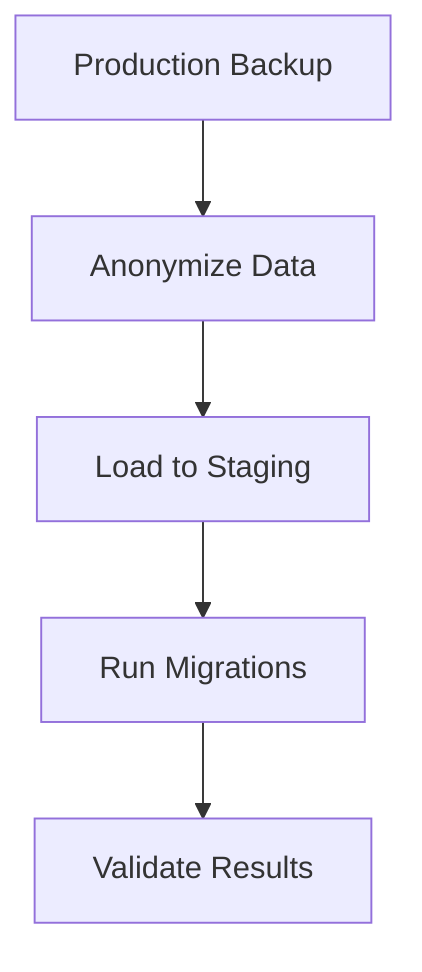

# Database Migration Prevention Strategy

## 1. Schema Design Guidelines

### Proper Data Type Selection
- **Examples from current migrations**:
  ```php
  // Good - Specific unsigned integer for IDs
  $table->unsignedBigInteger('featured_image_id')->nullable();
  
  // Avoid - Generic integer types without constraints
  $table->integer('featured_image_id');
  ```

### Foreign Key Planning
- **Relationship patterns**:
  ```php
  // Explicit constraint naming
  $table->foreign('featured_image_id', 'fk_contents_featured_image')
         ->references('id')->on('media')
         ->onDelete('SET NULL');
  ```

### Nullable vs Required Fields
- **Decision framework**:
  | Scenario | Recommendation |
  |----------|----------------|
  | New feature rollout | Nullable first |
  | Core business data | Required |

### Index Optimization
- **Query pattern analysis**:
  ```php
  // Composite index for common filters
  $table->index(['is_published', 'publish_date'], 'idx_published_content');
  ```

## 2. Testing Procedures

### Pre-Production Migration Testing
1. Create staging environment snapshot
2. Run migration with `--pretend` flag
3. Verify schema changes

### Automated Schema Validation
```bash
# Example validation script
php artisan schema:validate \
  --expect-table=contents \
  --expect-column=featured_image_id:unsignedBigInteger:nullable
```

### Test Database Refresh


## 3. Team Coordination

### Migration Naming Conventions
```
[YEAR]_[MONTH]_[DAY]_[HOUR][MINUTE][SECOND]_[ACTION]_[TABLE]_[COLUMN].php
Example: 2025_05_06_210000_fix_featured_image_id_type.php
```

### Change Communication Protocol
1. Migration proposed in #db-changes Slack channel
2. Schema change request ticket created
3. Team lead approval required

## 4. Safety Measures

### Atomic Migration Design
```php
public function up()
{
    DB::transaction(function () {
        // Migration operations here
    });
}
```

### Emergency Rollback Plan
1. Immediate rollback if errors > 1% of requests
2. Automated monitoring triggers
3. Fallback to last known good version

### Monitoring Dashboard
```sql
CREATE VIEW migration_monitoring AS
SELECT 
  migration,
  AVG(execution_time) as avg_time,
  COUNT(failed_attempts) as errors
FROM migration_logs
GROUP BY migration;