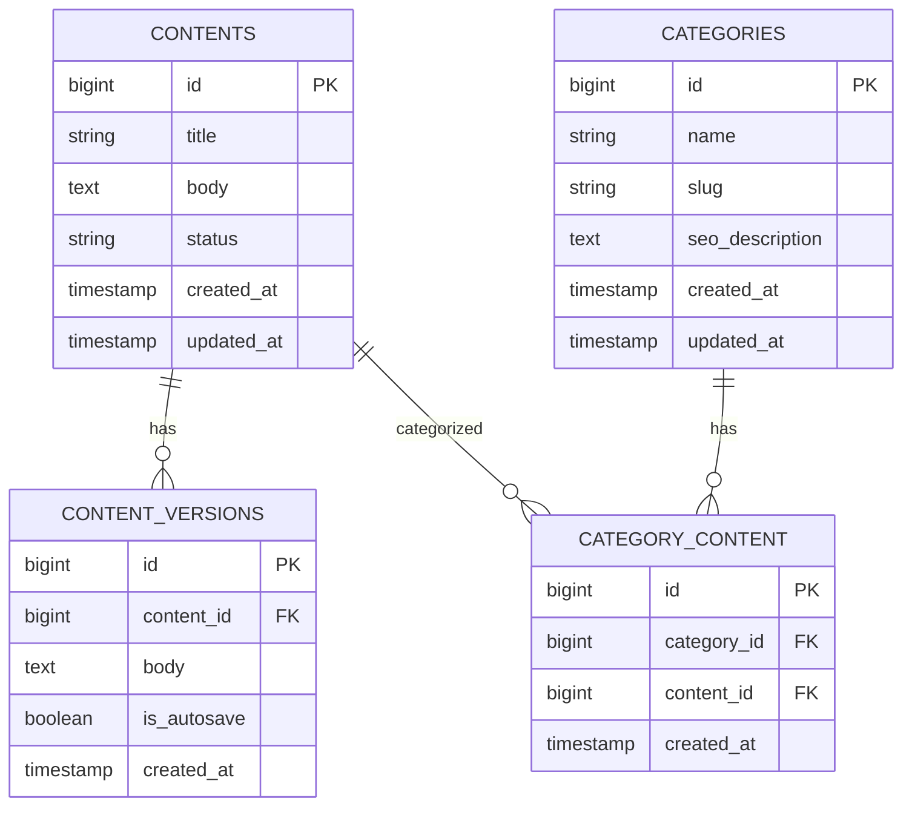

# Database Schema

## Entity Relationship Diagram

## Key Tables

### Contents
- Stores all content items
- Fields: id, title, body, status, created_at, updated_at
- Relationships: Has many versions, belongs to many categories

### Content Versions
- Tracks historical versions of content
- Fields: id, content_id, body, is_autosave, created_at
- Relationships: Belongs to content

### Categories
- Organizes content into hierarchical categories
- Fields: id, name, slug, seo_description, created_at, updated_at
- Relationships: Belongs to many contents

### Category Content
- Junction table for content categorization
- Fields: id, category_id, content_id, created_at

## Indexes
- `contents(status)` - For filtering by publication status
- `content_versions(content_id)` - For version lookup
- `categories(slug)` - For URL routing
- `category_content(category_id, content_id)` - For efficient categorization queries

## Data Retention
- Content versions are retained indefinitely
- Soft deletes used for all main tables
- Automated archiving of old versions after 1 year