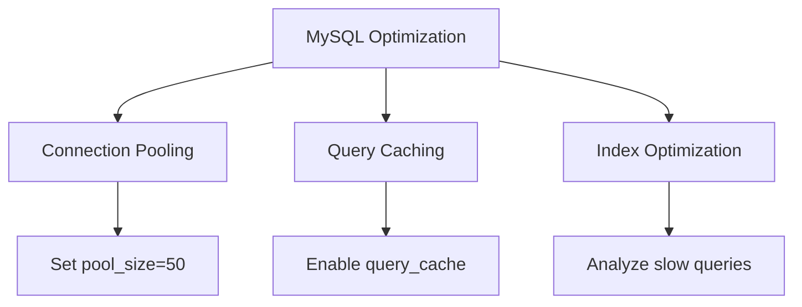
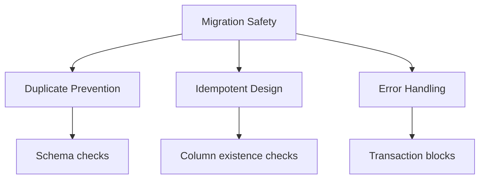

# Database Optimization Recommendations

## Current Configuration Analysis
- **Default Connection**: MySQL (configured via environment variables)
- **Redis Cache**: Configured with separate databases for default and cache
- **Strict Mode**: Enabled (recommended for production)

## Optimization Recommendations

### MySQL Configuration


1. **Connection Pooling**:
   - Recommended pool size: 50 connections
   - Add to MySQL config:
     ```
     [mysqld]
     max_connections=200
     thread_cache_size=50
     ```

2. **Query Optimization**:
   - Enable slow query logging
   - Set long_query_time = 1 second
   - Review indexes on frequently queried tables

3. **Buffer Settings**:
   - Increase innodb_buffer_pool_size (recommend 70% of available RAM)
   - Set innodb_log_file_size to 1GB

### Redis Configuration
- **Current Settings**:
  - Client: phpredis
  - Persistent connections: disabled
- **Recommendations**:
  - Enable persistent connections
  - Increase maxmemory to 2GB
  - Set eviction policy to volatile-lru

### Migration Best Practices



1. **Duplicate Prevention**:
   - System now automatically detects duplicate table creation attempts
   - Conflicts show original migration timestamp for resolution

2. **Idempotent Migrations**:
   - Always check if columns/tables exist before modifying:
   ```php
   if (!Schema::hasColumn('table', 'column')) {
       $table->string('column');
   }
   ```

3. **Error Handling**:
   - Wrap migrations in transaction blocks
   - Use try-catch for complex operations
   - Implement proper rollback procedures

4. **Existing Settings**:
   - Keep `update_date_on_publish` enabled for auditability
   - Consider adding batch tracking for large migrations

## Production Checklist
- [ ] Verify database backups are working
- [ ] Test failover procedures
- [ ] Set up replication monitoring
- [ ] Configure connection timeouts
- [ ] Enable query logging
- [ ] Review all indexes
- [ ] Test with production-like data volume

## Performance Metrics to Monitor
| Metric | Target Value | Alert Threshold |
|--------|-------------|-----------------|
| Query Response Time | <100ms | >500ms |
| Connection Wait Time | <10ms | >100ms |
| Cache Hit Ratio | >95% | <90% |
| Replication Lag | <1s | >5s |