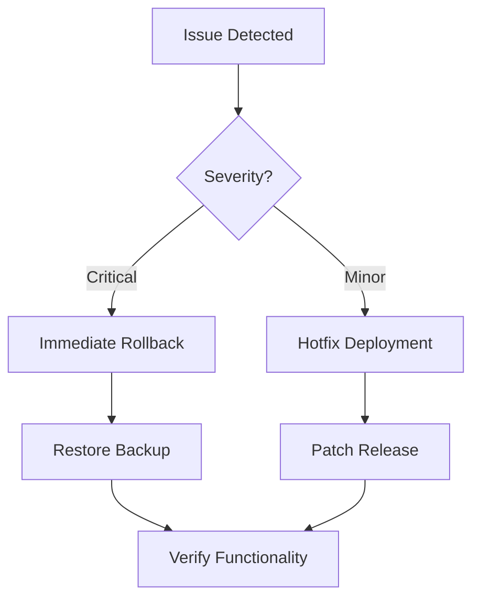

# Final Deployment Readiness Checklist

## Infrastructure Verification
- [ ] MySQL configuration updated
- [ ] Redis production configuration verified:
  - [ ] Authentication enabled
  - [ ] TLS configured (if applicable)
  - [ ] Memory limits set
  - [ ] Timeouts configured (5s)
  - [ ] Persistent connections enabled
  - [ ] Monitoring metrics integrated
  - [ ] Deployment script tested
- [ ] Database migrations tested
- [ ] Connection pooling validated
- [ ] Failover procedures documented

## Performance Validation
- [ ] Load testing completed
- [ ] Query optimization verified
- [ ] Cache hit ratios measured
- [ ] Response times benchmarked
- [ ] Scaling configuration tested

## Monitoring Setup
- [ ] Grafana dashboards deployed
- [ ] Alert thresholds configured
- [ ] Metric collection verified
- [ ] Log aggregation working
- [ ] Notification channels tested

## Rollback Plan

## Final Sign-off
- [ ] Development Team
- [ ] Operations Team
- [ ] Security Team
- [ ] Product Owner

## Post-Deployment Tasks
1. Monitor system for 24 hours
2. Verify automated backups
3. Review performance metrics
4. Schedule optimization review in 7 days