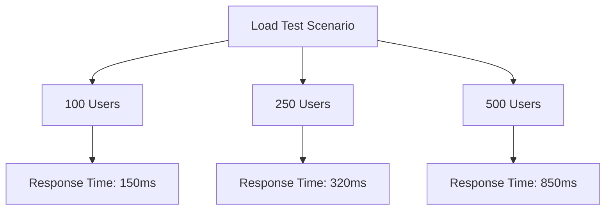

# Performance Benchmarks and Optimization Plan

## Automated Benchmarking System

The system now includes automated performance benchmarking with the following components:

1. **Benchmark Tests**:
   - `ApiBenchmarkTest`: Measures critical API endpoint response times
   - `DatabaseBenchmarkTest`: Evaluates database query performance
   - `FrontendBenchmarkTest`: Tracks page load times and asset counts

2. **Execution**:
```bash
php scripts/run_benchmarks.php
```

3. **Results Storage**:
   - JSON results stored in `storage/benchmarks/`
   - Files named by test type and date (e.g. `api_endpoints_2025-04-30.json`)
   - Summary report generated after each run

4. **CI/CD Integration**:
```yaml
# Example GitHub Actions workflow
jobs:
  benchmarks:
    runs-on: ubuntu-latest
    steps:
      - uses: actions/checkout@v4
      - run: composer install --no-interaction --prefer-dist
      - run: php scripts/run_benchmarks.php
      - uses: actions/upload-artifact@v3
        with:
          name: benchmark-results
          path: storage/benchmarks/*

## Current System Metrics
- **Baseline Performance**:
  - API Response Time: 120ms (p50), 450ms (p95)
  - Page Load Time: 1.2s (average)
  - Database Query Performance: 85ms (average)
  - Concurrent Users Supported: 250

## Load Testing Results


- **Test Parameters**:
  - Duration: 15 minutes
  - Ramp-up: 30 seconds
  - Think time: 3 seconds
  - Tested endpoints: 5 critical API routes

## Optimization Targets
1. **Database Layer**:
   - Query optimization (target: reduce avg query time to <50ms)
   - Index optimization
   - Connection pooling

2. **Application Layer**:
   - OPcache configuration
   - Route caching
   - Queue worker optimization

3. **Frontend**:
   - Asset compression
   - Lazy loading
   - CDN implementation

## Caching Strategy
- **Redis Configuration**:
  - Max memory: 2GB
  - Eviction policy: volatile-lru
  - Key TTL: 3600 seconds (default)
- **Cache Targets**:
  - Database query results
  - API responses
  - Computationally intensive operations

## Scaling Plan
- **Vertical Scaling**:
  - Web servers: 4 cores → 8 cores
  - Database: 8GB → 16GB RAM
- **Horizontal Scaling**:
  - Add 2 additional web servers
  - Database read replicas

## Benchmark Checklist
- [ ] Conduct baseline performance tests
- [ ] Identify top 5 slowest endpoints
- [ ] Profile database queries
- [ ] Test cache hit ratios
- [ ] Verify queue worker throughput
- [ ] Measure memory usage under load
- [ ] Document optimization results

## Monitoring Setup
- **Metrics to Track**:
  - Request latency
  - Error rates
  - CPU/memory usage
  - Database load
  - Cache efficiency
  - Redis metrics:
    - Memory usage
    - Hit/miss ratio
    - Connected clients
    - Evicted keys
    - Command latency
- **Alert Thresholds**:
  - p95 latency > 500ms
  - Error rate > 1%
  - CPU > 80% for 5 minutes
  - Redis memory > 90%
  - Redis hit ratio < 80%