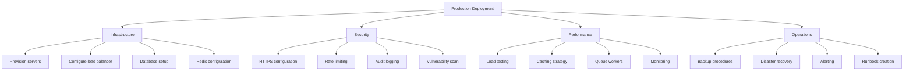

# Production Deployment Checklist

## Infrastructure Provisioning
- [ ] Provision servers meeting minimum requirements (4 cores, 8GB RAM)
- [ ] Configure load balancer for high availability
- [ ] Set up MySQL 8.0+ with proper credentials
- [ ] Configure Redis 6.0+ for caching
- [ ] Install PHP 8.2+ with required extensions
- [ ] Set up Node.js 18+ for asset compilation
- [ ] Configure storage volumes for uploads
- [ ] Set up queue workers (Supervisor configuration)

## Security Review
- [ ] Configure HTTPS with valid certificate
- [ ] Set proper Sanctum stateful domains in .env
- [ ] Implement rate limiting for APIs
- [ ] Enable audit logging for sensitive operations
- [ ] Run vulnerability scan before deployment
- [ ] Configure proper file permissions (755 for dirs, 644 for files)
- [ ] Set up firewall rules (SSH, HTTP, HTTPS only)
- [ ] Configure automated security updates

## Performance Review
- [ ] Conduct load testing with realistic traffic
- [ ] Optimize Redis cache configuration
- [ ] Configure queue workers with Supervisor
- [ ] Set up monitoring (Prometheus/Grafana)
- [ ] Configure OPcache for PHP
- [ ] Enable database query caching
- [ ] Set up CDN for static assets
- [ ] Configure proper session driver (Redis)

## Operational Readiness
- [ ] Set up automated database backups
- [ ] Document rollback procedures
- [ ] Configure alert thresholds
- [ ] Schedule maintenance windows
- [ ] Create operational runbook
- [ ] Set up log rotation
- [ ] Document deployment procedures
- [ ] Create incident response plan

## Next Steps
1. Review and customize this checklist for your specific environment
2. Assign team members to each checklist item
3. Schedule deployment timeline
4. Conduct pre-deployment testing
5. Execute deployment during maintenance window