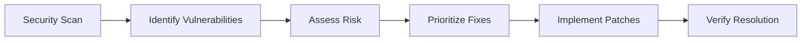

# Production Security Assessment

## Authentication & Authorization
- **Current Configuration**:
  - Web guard: Session-based
  - API guard: Sanctum tokens
  - Password reset: 60 minute expiry
  - Password confirmation timeout: 3 hours
- **Recommendations**:
  - Enable 2FA for admin accounts
  - Implement password complexity requirements
  - Set token expiration (recommend 30 days)
  - Review role-based access controls

## API Security
- **Sanctum Configuration**:
  - Stateful domains: `{{env('SANCTUM_STATEFUL_DOMAINS')}}`
  - Token prefix: `{{env('SANCTUM_TOKEN_PREFIX')}}`
- **Recommendations**:
  - Restrict stateful domains to production only
  - Enable token prefixing
  - Implement rate limiting (100 requests/minute)
  - Add IP whitelisting for admin APIs

## Data Protection
- **Current Measures**:
  - Database encryption at rest
  - HTTPS enforced
  - Session encryption
- **Recommendations**:
  - Enable field-level encryption for PII
  - Implement data masking in logs
  - Set up database activity monitoring
  - Regular security patching schedule

## Vulnerability Management

- **Scanning Plan**:
  - Weekly automated scans
  - Pre-deployment penetration test
  - Dependency vulnerability checks (npm/composer)
  - Container scanning (if using Docker)

## Audit & Compliance
- **Logging Requirements**:
  - Authentication events
  - Sensitive data access
  - Configuration changes
  - Admin actions
- **Retention Policy**:
  - 90 days online
  - 1 year archived

## Incident Response
- **Response Plan**:
  1. Immediate isolation of affected systems
  2. Forensic evidence collection
  3. Vulnerability remediation
  4. Post-mortem analysis
  5. Process improvement

## Security Checklist
- [ ] Verify all endpoints use HTTPS
- [ ] Validate CSRF protection
- [ ] Test SQL injection protection
- [ ] Confirm XSS prevention
- [ ] Review CORS policies
- [ ] Check session timeout settings
- [ ] Audit third-party dependencies