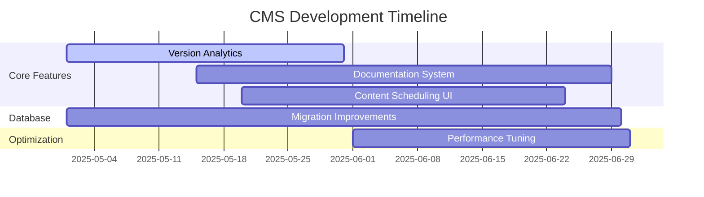
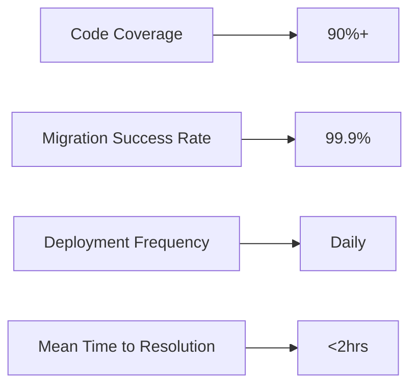

# CMS Development Execution Plan - Q2 2025

## Key Milestones

## Quality Assurance Checkpoints
1. **Pre-Migration Validation** (Weekly)
   - Schema change impact analysis
   - Test environment verification
   - Rollback procedure testing

2. **Code Review Gates**
   - Feature branch review before staging
   - Security audit for all data model changes
   - UI/UX review for frontend components

3. **Post-Deployment Verification**
   - Automated schema validation
   - Performance benchmarking
   - Error monitoring review

## Risk Mitigation Strategies
### Technical Risks
| Risk | Probability | Impact | Mitigation |
|------|------------|--------|------------|
| Migration failures | Medium | High | Use database transactions, staged rollouts |
| Schema conflicts | Low | High | Pre-flight checks, lock tables during critical updates |
| Performance degradation | Medium | Medium | Benchmark before/after changes |

### Process Risks
- **Case Study**: Database Migration Solution
  - Implement migration verification tooling
  - Create rollback procedures for all schema changes
  - Document dependency chains between migrations

## Collaboration Protocols
1. **Version Control**
   - Feature branches with PR reviews
   - Migration files prefixed with feature tags
   - Atomic commits for schema changes

2. **Team Coordination**
   - Daily standups focused on migration impacts
   - Shared documentation of schema decisions
   - Pair programming for complex data model changes

3. **Communication Channels**
   - Dedicated #migrations Slack channel
   - Weekly tech sync meetings
   - Post-mortems for any failed deployments

## Quality Metrics Tracking

## Implementation Timeline
1. **Week 1-2 (May)**: Complete Version Analytics
   - Finalize dashboard
   - Implement remaining API endpoints
   - Documentation 

2. **Week 3-6**: Documentation System
   - Technical spec consolidation
   - API documentation generation
   - User guide templates

3. **Week 7-8**: Content Scheduling UI
   - Calendar component
   - Timezone handling
   - Conflict resolution UI

4. **Ongoing**: Database Improvements
   - Migration safety enhancements
   - Performance optimizations
   - Monitoring integration