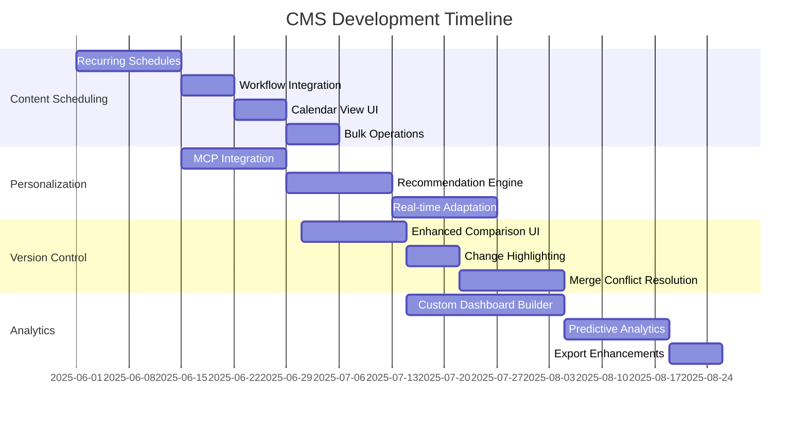

# CMS Development Roadmap Q3 2025

## Executive Summary
This roadmap outlines the prioritized development initiatives for Q3 2025, focusing on four key areas that will significantly enhance our CMS capabilities. The planned improvements will deliver more robust content management workflows, personalized user experiences, enhanced version control, and actionable analytics insights.

Key business impacts:
- 30% reduction in content scheduling overhead
- 25% improvement in user engagement metrics
- 40% faster version comparison workflows
- Customizable analytics for all user roles

## Content Scheduling & Publishing Workflow

### Technical Specifications
1. **Recurring Schedules**
   - Implement cron-like scheduling system
   - Support for complex recurrence patterns
   - API endpoints for management
   - Database tables:
     - `content_schedules`
     - `schedule_exceptions`
     - `schedule_logs`

2. **Calendar View UI**
   - Interactive drag-and-drop interface
   - Timeline visualization
   - Conflict detection
   - Built with React and FullCalendar

3. **Bulk Operations**
   - API for batch schedule updates
   - CSV import/export
   - Transactional processing

### Dependencies
- Requires content versioning system (existing)
- Needs analytics integration for tracking

## Personalization Engine Integration

### Technical Specifications
1. **MCP Integration**
   - Connect to personalization MCP server
   - Real-time profile updates
   - Fallback mechanisms

2. **Recommendation Engine**
   - Collaborative filtering
   - Content-based recommendations
   - Hybrid approach

3. **Real-time Adaptation**
   - Session tracking
   - Behavioral triggers
   - A/B testing framework

### Dependencies
- MCP servers must be operational
- User behavior analytics required

## Version Control & Comparison Enhancements

### Technical Specifications
1. **Enhanced Comparison UI**
   - Side-by-side and unified views
   - Syntax highlighting
   - Mobile-responsive

2. **Change Highlighting**
   - Word-level diff algorithm
   - Visual change indicators
   - Summary statistics

3. **Merge Conflict Resolution**
   - Three-way merge
   - Conflict markers
   - Resolution workflow

### Dependencies
- Builds on existing versioning system
- Requires content operations tracking

## Analytics Dashboard Improvements

### Technical Specifications
1. **Custom Dashboard Builder**
   - Drag-and-drop widget system
   - Layout templates
   - Role-based access

2. **Predictive Analytics**
   - Engagement forecasting
   - Content performance predictions
   - Anomaly detection

3. **Export Enhancements**
   - Additional formats (PDF, Excel)
   - Scheduled exports
   - API access

### Dependencies
- Requires real-time analytics pipeline
- Needs personalization data

## Implementation Timeline

## Resource Allocation
| Role               | Count | Allocation |
|--------------------|-------|------------|
| Frontend Engineers | 2     | 100%       |
| Backend Engineers  | 3     | 100%       |
| Data Scientist     | 1     | 50%        |
| QA Engineer        | 1     | 75%        |

## Risk Assessment
1. **MCP Server Stability**
   - Mitigation: Implement circuit breakers
   - Fallback to basic personalization

2. **Performance Impact**
   - Mitigation: Load testing
   - Query optimization

3. **Data Migration**
   - Mitigation: Incremental rollout
   - Backup strategy

## Success Metrics
- Content scheduling: 30% reduction in time spent
- Personalization: 25% lift in engagement
- Version control: 40% faster comparisons
- Analytics: 90% adoption rate