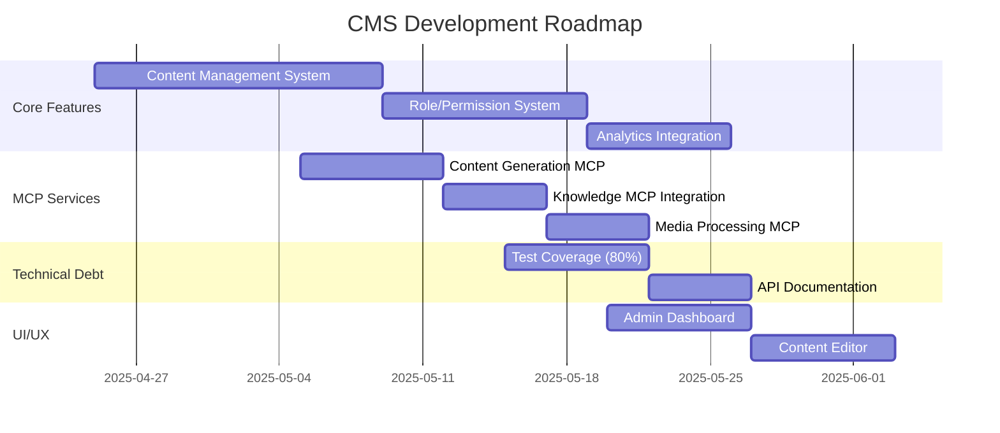

# CMS Development Roadmap

## Feature Descriptions

### Content Management System
- Hierarchical content organization with categories
- Version control with diff comparison
- Scheduled publishing/expiration
- Bulk operations (import/export, updates)
- SEO metadata management

### Role & Permission System
- Fine-grained permission control
- Role inheritance and templates
- Audit logging for all changes
- User impersonation for testing
- API endpoints for management

### Analytics Integration
- Content engagement tracking
- AI usage monitoring
- Custom report generation
- Scheduled exports
- Dashboard visualization

### MCP Services
- **Content Generation**: AI-assisted content creation
- **Knowledge**: CMS documentation and help system
- **Media Processing**: Image/video optimization
- **Personalization**: User-specific content delivery

## Technical Specifications

### Architecture
- **Backend**: Laravel 10 (PHP 8.2)
- **Frontend**: Livewire, Alpine.js, TailwindCSS
- **Database**: MySQL 8 with Redis caching
- **Search**: Laravel Scout with database driver
- **API**: RESTful with Sanctum authentication

### Key Packages
- `spatie/laravel-permission` for RBAC
- `laravel/sanctum` for API auth
- `livewire/livewire` for reactive UI
- `maatwebsite/excel` for exports
- `openai-php/client` for AI features

## Implementation Phases

### Phase 1: Core CMS (4 weeks)
1. Content model finalization
2. Base controllers and services
3. Version control system
4. Basic admin UI

### Phase 2: Extended Features (3 weeks)
1. Role/permission system
2. Analytics integration
3. Scheduled jobs
4. Export functionality

### Phase 3: MCP Integration (2 weeks)
1. Content generation service
2. Knowledge base integration
3. Media processing pipeline
4. Personalization engine

### Phase 4: Polishing (1 week)
1. Documentation
2. Testing
3. Performance optimization
4. Deployment preparation

## Dependencies

### System Requirements
- PHP 8.2+
- MySQL 8.0+
- Redis 6.0+
- Node.js 18+ (for frontend)

### External Services
- OpenAI API (content generation)
- MCP servers (content, knowledge, media)
- SMTP service (notifications)
- Storage service (S3 compatible)

### Development Tools
- Composer 2.0+
- NPM 8.0+
- Docker (optional for local dev)

## Estimated Timelines

| Component           | Estimated Time | Priority |
|---------------------|----------------|----------|
| Content Management  | 4 weeks        | P0       |
| Role System         | 2 weeks        | P0       |
| Analytics           | 1.5 weeks      | P1       |
| MCP Integration     | 2 weeks        | P1       |
| Testing             | 1 week         | P2       |
| Documentation       | 0.5 weeks      | P2       |

## Risk Assessment

1. **Content Model Complexity** - Mitigation: Start with MVP model
2. **Permission Performance** - Mitigation: Implement caching
3. **AI Content Quality** - Mitigation: Human review workflow
4. **MCP Service Reliability** - Mitigation: Fallback mechanisms
