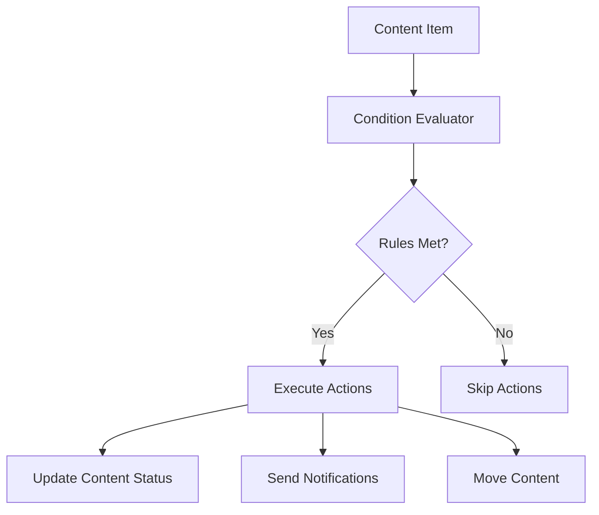

# Conditional Publishing System

## System Architecture

### Components

1. **Rule Engine**
   - Evaluates content against configured rules
   - Processes conditions sequentially
   - Executes all matching actions

2. **Condition Evaluator**
   - Checks content properties against rule conditions
   - Supports multiple condition types:
     - Content status
     - Category membership
     - Tag presence
     - Custom fields

3. **Action Executor**
   - Performs actions when conditions are met:
     - Publish/unpublish content
     - Send notifications
     - Move to different category
     - Trigger workflows

### Data Flow

1. Content update triggers evaluation
2. System checks all active rules
3. For each matching rule:
   - Conditions are validated
   - Actions are executed in order
4. Results are logged for auditing

### Rule Evaluation Process

1. Content enters evaluation queue
2. Rules are filtered by:
   - Content type
   - Active status
   - Schedule
3. Conditions evaluated using AND logic
4. All matching actions executed