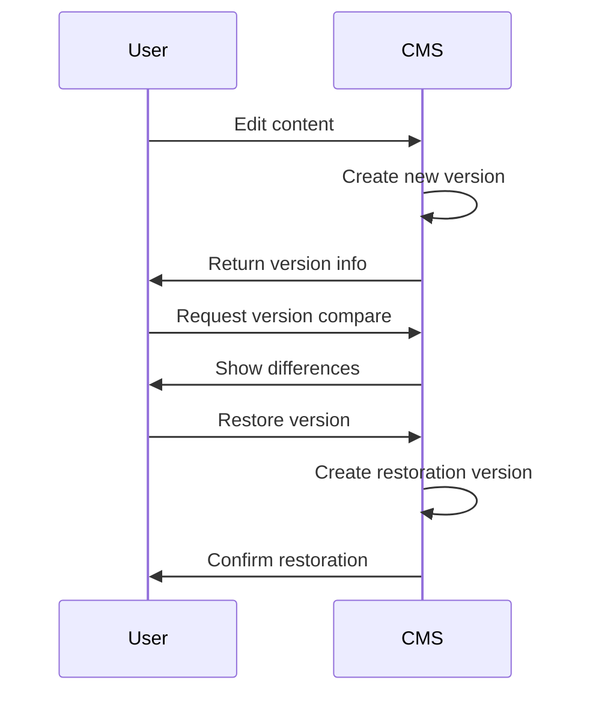

# Content Management

## Core Features
- **Versioned Content**: All changes create new versions
- **Workflow System**: Approval process for publishing
- **Organization**: Categories and tags
- **Scheduling**: Future publish/unpublish dates

## Version Control
- Automatic versioning on save
- Visual comparison between versions
- One-click restoration
- Branching support for parallel edits

### Version Operations

## Media Handling
- Drag-and-drop uploads
- Automatic image optimization
- Collections for organization
- Metadata storage (EXIF, IPTC)
- Transformations via MCP Media Processing