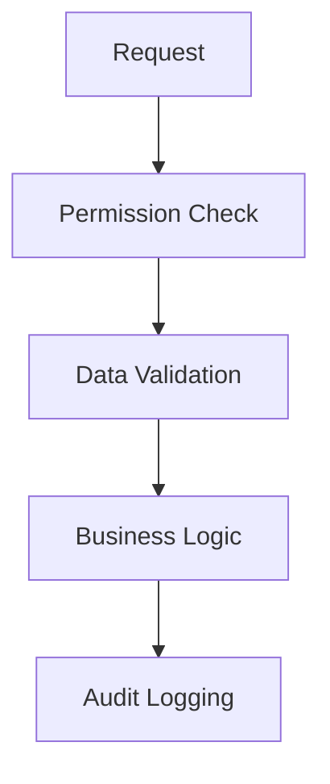

# GDPR Compliance - Developer Guide

## 1. Implementation Overview


## 2. Security Considerations
### CSRF Protection
- Tokens expire after 30 minutes
- Secondary header `X-GDPR-Verify` required
- Per-action token validation implemented

### Data Validation
```php
// Example validation
function validatePersonalData($input) {
    // Strip all HTML tags
    $clean = strip_tags($input);
    // Validate email format if applicable
    if (filter_var($clean, FILTER_VALIDATE_EMAIL)) {
        return sanitizeEmail($clean);
    }
    return htmlspecialchars($clean, ENT_QUOTES, 'UTF-8');
}
```

## 3. Audit Logging Requirements
- All GDPR actions must log:
  - Timestamp (UTC)
  - Admin/System ID
  - Action type (export/delete/etc)
  - Affected user ID
  - Data scope

## 4. Encryption Standards
- Personal data at rest: AES-256
- Data in transit: TLS 1.2+
- Key rotation every 90 days

## 5. Error Handling
- Never expose raw errors to end users
- Log detailed errors internally
- Return generic messages to users