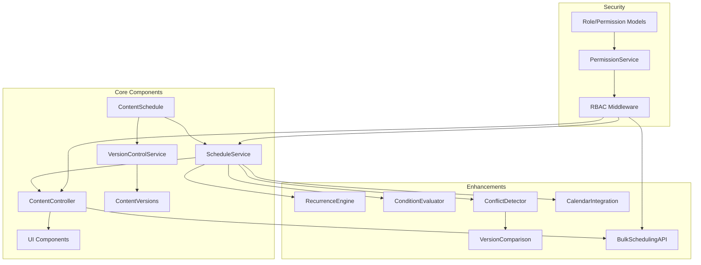

# Content Scheduling Enhancements Architecture Plan

## Integrated Architecture



## Implementation Status (2025-05-16)

### Phase 1: Core Integration (Complete)
1. Version control integration:
   - Automatic versioning on scheduled operations
   - Version comparison for conflict detection
2. RBAC implementation:
   - New permissions for scheduling operations
   - Middleware integration

### Phase 2: Recurring & Conditional (Complete)
1. **RecurrenceEngine with version tracking**
   - Implemented in VersionedScheduleService
   - 1-hour conflict detection window for different versions
2. **ConditionEvaluator with permission checks**
   - Integrated with SchedulingPermissionService
   - Bulk evaluation API endpoint
3. **UI updates with version awareness**
   - Version timeline in scheduler
   - Permission-aware scheduling UI

### Phase 3: Conflict & Bulk (In Progress)
1. ConflictDetector with version history
2. BulkSchedulingAPI with RBAC
3. Performance optimizations

## API Endpoint Specifications

### Bulk Operations
- **POST /api/schedules/bulk**
  - Creates multiple scheduled events
  - Requires 'schedule_content' permission
  - Request body:
    ```json
    {
      "events": [
        {
          "content_id": 123,
          "version_id": 456,
          "scheduled_at": "2025-05-20T12:00:00Z",
          "conditions": []
        }
      ]
    }
    ```
  - Returns array of results with success/error status

- **PUT /api/schedules/bulk**
  - Updates multiple scheduled events
  - Requires 'schedule_content' permission
  - Request body:
    ```json
    {
      "updates": [
        {
          "event_id": 789,
          "scheduled_at": "2025-05-21T12:00:00Z"
        }
      ]
    }
    ```

- **POST /api/schedules/evaluate**
  - Evaluates conditions for bulk scheduling
  - Requires 'schedule_content' permission
  - Request body:
    ```json
    {
      "evaluations": [
        {
          "content_id": 123,
          "version_id": 456,
          "conditions": []
        }
      ]
    }
    ```

## Permission Requirements

| Permission | Description | Roles |
|------------|-------------|-------|
| schedule_content | Schedule content for future publishing | admin, editor |
| view_scheduled_content | View scheduled content | admin, editor, author |
| view_content_versions | View content version history | admin |

## Usage Examples

### Scheduling Content with Version
```php
$scheduleService->scheduleWithVersion(
    $contentId,
    $versionId,
    new DateTime('2025-05-20 12:00:00')
);
```

### Checking for Conflicts
```php
$conflicts = $scheduleService->checkForConflicts(
    $contentId,
    $versionId,
    new DateTime('2025-05-20 12:00:00')
);
```

### Bulk Scheduling via API
```javascript
fetch('/api/schedules/bulk', {
    method: 'POST',
    headers: {
        'Content-Type': 'application/json',
        'Authorization': 'Bearer token'
    },
    body: JSON.stringify({
        events: [{
            content_id: 123,
            version_id: 456,
            scheduled_at: '2025-05-20T12:00:00Z'
        }]
    })
});