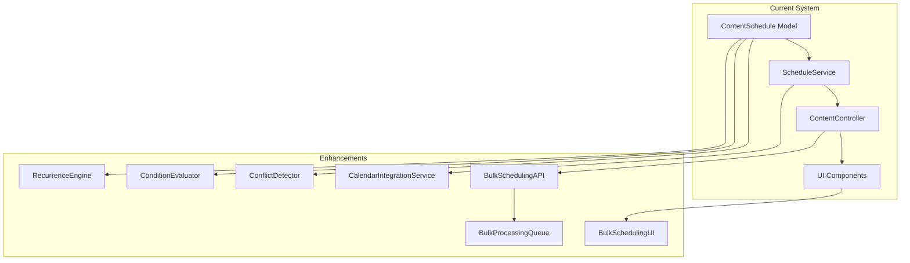

# Content Scheduling Enhancements Implementation Plan

## Overview
Enhancements to the CMS content scheduling system including:
1. Advanced scheduling options (recurring, conditional)
2. Calendar service integration  
3. Conflict detection system
4. Bulk scheduling interface

## Architecture

## Implementation Phases

### Phase 1: Recurring Schedules
1. Extend ContentSchedule model:
   - Add recurrence_rules JSON field
   - Add next_occurrence timestamp
2. Create RecurrenceEngine service:
   - Handles RRULE standard
   - Calculates future instances
3. Update ScheduleService:
   - Process recurring schedules
   - Generate child instances

### Phase 2: Conditional Scheduling  
1. Create ConditionEvaluator service:
   - Content conditions (tags, status)
   - Audience conditions (segments, location)
   - Time-based conditions
2. Extend API:
   - New condition fields
   - Evaluation endpoints

### Phase 3: Conflict Detection
1. Create ConflictDetector service:
   - Content dependency checks
   - Timeline validation
   - Resolution suggestions
2. UI integration:
   - Visual conflict indicators
   - Resolution workflow

### Phase 4: Calendar Integration
1. Create CalendarIntegrationService:
   - Google Calendar API
   - Outlook Calendar API  
   - Two-way sync
2. Authentication:
   - OAuth2 flow
   - Token management

### Phase 5: Bulk Operations
1. Create BulkSchedulingAPI:
   - CSV/JSON import
   - Async processing
   - Status tracking
2. Build BulkSchedulingUI:
   - File upload
   - Template download
   - Progress monitoring

## Testing Strategy
- Unit tests for all new services
- Integration tests for API endpoints
- E2E tests for UI workflows
- Performance testing for bulk operations
- Compatibility testing with existing schedules

## Documentation
- API reference for new endpoints
- User guide for new features
- Developer guide for extension points