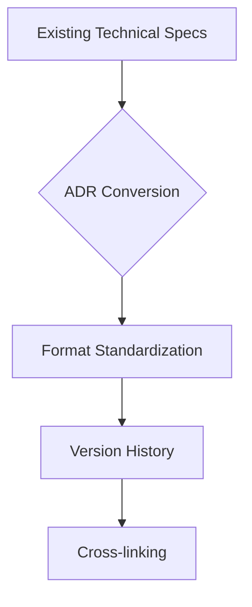
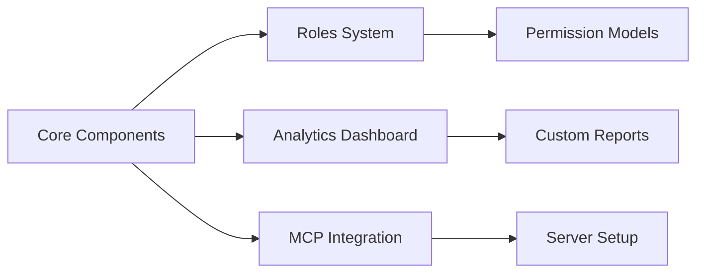
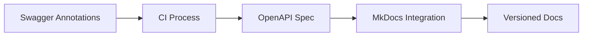
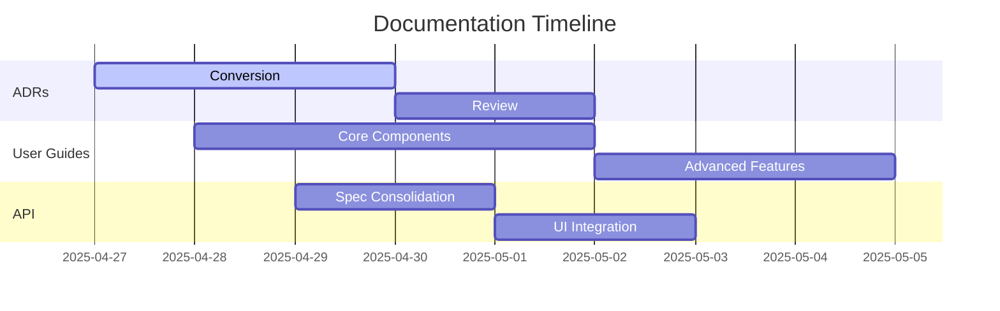
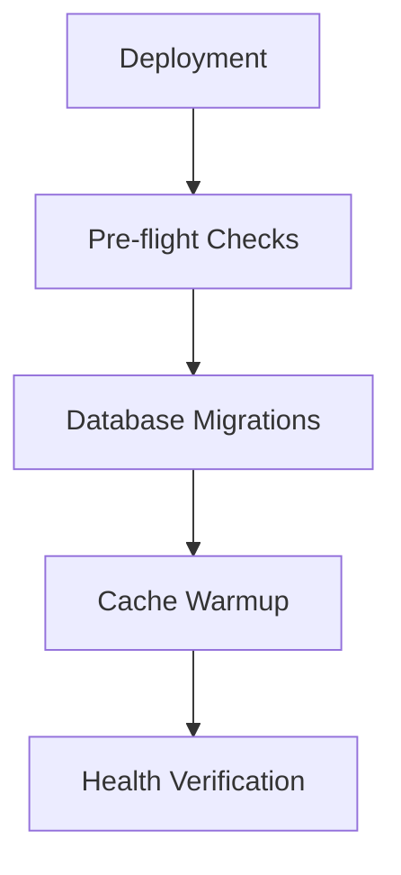
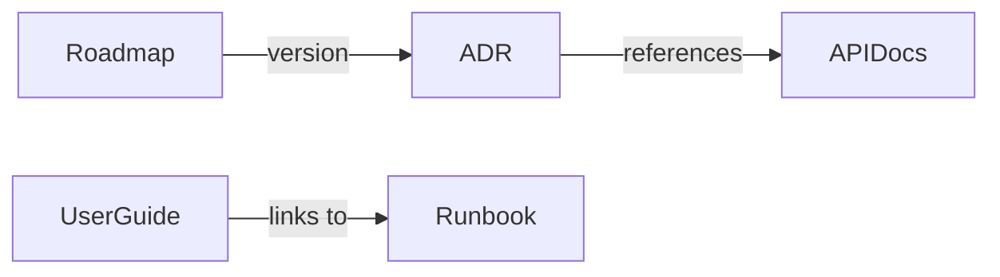

# Documentation Overhaul Implementation Plan

## 1. Architecture Decision Records (ADRs)


### Conversion Process:
1. Create `docs/architecture/decisions/` directory
2. Convert each section from `technical-specs-v2.md` using template:
```markdown
# ADR-{num}: {Title}

## Status
✅ Approved | ⌛ Proposed | ❌ Deprecated

## Context
{Problem description}

## Decision
{Chosen solution}

## Consequences
- Positive impacts
- Trade-offs
- Migration requirements
```

## 2. User Guides Structure


### Implementation Sources:
- Role management: `assign_role.php`, `config/auth.php`
- Analytics: `database/migrations/2025_04_25_183000_create_content_comparison_analytics_table.php`
- MCP: `mcp-knowledge/server.js`

## 3. API Documentation Pipeline


### Automation Steps:
1. Configure `config/l5-swagger.php` for spec consolidation
2. Add CI step to generate docs on merge
3. Integrate with mkdocs-material using:
```yaml
plugins:
  - redoc:
      spec: 'api/combined.openapi.yaml'
```

## 4. Roadmap Integration


## 5. Deployment Runbooks


### Key Procedures:
- Zero-downtime deployment using `cache_cms_files.sh`
- Rollback process from `ContentRestorationsTable` schema
- Monitoring integration based on `config/analytics.php`

## Cross-linking Strategy
````markdown


