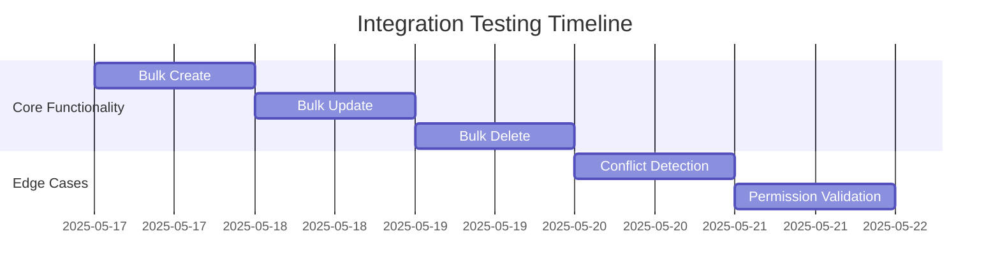

# Phase 3 Batch Processing Implementation Plan

## Current Status (2025-05-16)
- Core functionality implemented (80% complete)
- Remaining tasks:
  - Integration testing
  - API documentation
  - Technical debt resolution

## Technical Debt Items
1. Add missing scheduling permissions in migration
2. Document all API endpoints
3. Increase test coverage

## Implementation Tasks

### 1. Integration Testing

### 2. API Documentation
- Document all scheduling endpoints
- Include permission requirements
- Add examples for bulk operations
- Document conflict resolution workflow

### 3. Technical Debt Resolution
- Update migrations to include all scheduling permissions
- Add test cases for all permission levels
- Verify RBAC integration

## Architectural Decisions
1. Maintain current RBAC permission structure:
   - Admin: Full access
   - Editor: Schedule + view
   - Author: View only
2. Keep bulk operation endpoints separate from single-item operations
3. Use existing conflict detection implementation

## Phase 4 Preparation
1. Review content pipeline integration points
2. Identify notification requirements
3. Plan for recurring schedules feature