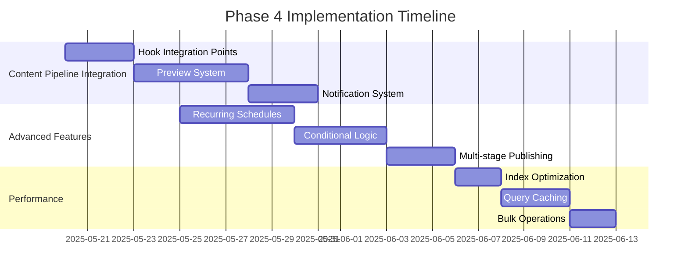

# Phase 4: Advanced Scheduling Enhancements

## Implementation Timeline

## Implementation Details

### 1. Content Pipeline Integration
- Add preview column to scheduled_events table
- Create preview endpoint in scheduling API
- Integrate with existing content workflow hooks
- Implement notification system using existing infrastructure

### 2. Advanced Scheduling Features
- Add recurrence_pattern column to scheduled_events
- Create new API endpoints for recurring schedules
- Implement conditional scheduling logic
- Design multi-stage publishing workflow

### 3. Performance Optimization
- Add composite indexes for common query patterns
- Implement query caching for schedule listings
- Optimize bulk operations with batch processing

## Dependencies
- Requires completion of Phase 3 RBAC implementation
- Relies on existing notification service
- Uses current content versioning system