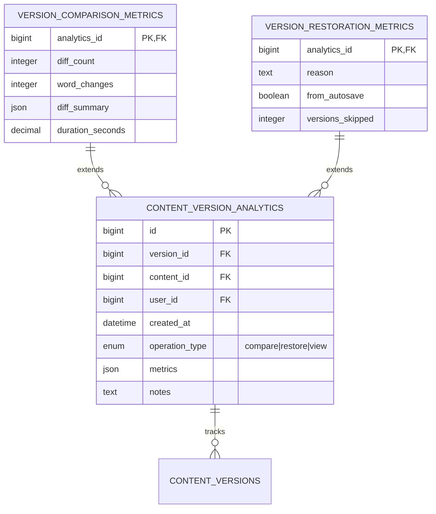

# Content Versioning Analytics Integration Plan

## 1. Database Changes
### New Tables Required:


### Schema Modifications:
- Add `analytics_enabled` boolean to `contents` table
- Add `last_analytics_sync` timestamp to `content_versions` table
- Add JSON `analytics_settings` column to `users` table

### Indexing Strategy:
- Composite index on (content_id, version_id, operation_type)
- Time-based partitioning for analytics tables
- Columnstore indexes for analytical queries

## 2. API Endpoints
### New REST Endpoints:
| Endpoint | Method | Description | Auth |
|----------|--------|-------------|------|
| `/api/content/{content}/versions/analytics` | GET | Get version analytics summary | JWT |
| `/api/content/{content}/versions/{version}/analytics` | GET | Get specific version analytics | JWT |
| `/api/analytics/version-comparisons` | POST | Create comparison analytics record | JWT |
| `/api/analytics/version-restorations` | POST | Create restoration analytics record | JWT |

### Request/Response Examples:
```json
// Comparison analytics request
{
  "content_id": 123,
  "version_id": 456,
  "compared_with": 789,
  "metrics": {
    "diff_count": 15,
    "word_changes": 342,
    "duration_seconds": 1.23
  }
}

// Analytics summary response
{
  "content_id": 123,
  "total_comparisons": 42,
  "total_restorations": 5,
  "frequent_operations": [
    {"user_id": 1, "count": 12},
    {"user_id": 2, "count": 8}
  ],
  "version_heatmap": [
    {"version_id": 456, "comparisons": 15},
    {"version_id": 789, "comparisons": 10}
  ]
}
```

## 3. Frontend Components
### New UI Elements:
1. **Version Analytics Dashboard**
   - Timeline visualization of version operations
   - User activity heatmap
   - Version comparison frequency chart

2. **Comparison Diff Viewer**
   - Side-by-side diff visualization
   - Change statistics breakdown
   - Animated transition between versions

3. **Restoration Workflow**
   - Guided restoration with analytics insights
   - Impact prediction before restore
   - Post-restore confirmation with analytics

### Data Visualization Requirements:
- D3.js for interactive charts
- Heatmap.js for activity visualization
- Vis.js for timeline components

## 4. Testing Strategy
### Unit Tests:
- 100% coverage for analytics models
- Metric calculation validation
- Data anonymization tests

### Integration Tests:
- End-to-end analytics pipeline
- Performance benchmarking
- Concurrency testing

### Performance Testing:
- JMeter tests for:
  - 100 concurrent analytics writes
  - Complex analytical queries
  - Long-running aggregation jobs

## 5. Deployment Considerations
### Migration Scripts:
- Backfill existing version data
- Schema migration with zero downtime
- Data validation scripts

### Backward Compatibility:
- API versioning for analytics endpoints
- Feature flags for gradual rollout
- Dual-write during transition

### Rollback Plan:
1. Disable analytics collection
2. Revert schema changes
3. Archive collected data
4. Restore previous version