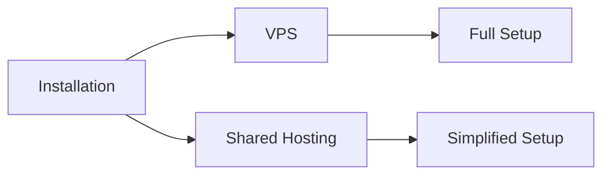

# CMS Installation Guide

## ⚠️ IMPORTANT CONFIGURATION WARNING
**Before making any configuration changes, read this section carefully!**

The following settings are critical for system stability and shared hosting compatibility:

1. **Session Configuration**:
   - `SESSION_DRIVER=database` (required for shared hosting)
   - `SESSION_LIFETIME=120` (do not increase beyond 1440)
   - `SESSION_SECURE_COOKIE=false` (must be false for HTTP)

2. **Filesystem Configuration**:
   - `FILESYSTEM_DISK=local` (required for shared hosting)
   - Storage path must remain `storage/app/private`

3. **Database Configuration**:
   - `DB_PERSISTENT=true` (required for shared hosting)
   - `DB_POOL_MIN=5` (do not reduce below 3)

**Warning**: Changing these settings without proper testing may cause:
- Session timeouts
- File permission errors
- Database connection failures

## System Requirements

### VPS Environment
- **Node.js**: 18.x-22.x
- **PHP**: 8.2+
- **Database**: SQLite/MySQL/PostgreSQL
- **Memory**: Minimum 2GB RAM
- **Web Server**: Nginx/Apache

### Shared Hosting
- **PHP**: 8.2+
- **Database**: SQLite/MySQL
- **Web Server**: Apache (with mod_php)

## Installation Methods



### VPS Installation
1. Clone repository:
   ```bash
   git clone https://github.com/your-repo/cms.git
   cd cms
   ```

2. Install dependencies:
   ```bash
   # Frontend
   npm install
   npm run build

   # Backend
   composer install --optimize-autoloader --no-dev
   ```

3. Configure environment:
   ```bash
   cp .env.example .env
   php artisan key:generate
   ```

4. Database setup:
   ```bash
   php artisan migrate --seed
   ```

### Shared Hosting Installation
1. Upload pre-built package (includes compiled assets)
2. Extract to web root
3. Configure `.env` file:
   ```ini
   APP_ENV=production
   DB_CONNECTION=mysql
   DB_HOST=localhost
   DB_DATABASE=your_db
   DB_USERNAME=your_user
   DB_PASSWORD=your_pass
   ```
4. Run database migrations via SSH:
   ```bash
   php artisan migrate --force
   ```

## Post-Installation
- Configure cron jobs for scheduled tasks
- Set up queue workers (VPS only)
- Configure caching
- Set proper file permissions

## Troubleshooting
- **Asset loading issues**: Run `php artisan storage:link`
- **Database errors**: Verify credentials in `.env`
- **Permission errors**: Set `storage` and `bootstrap/cache` to 755