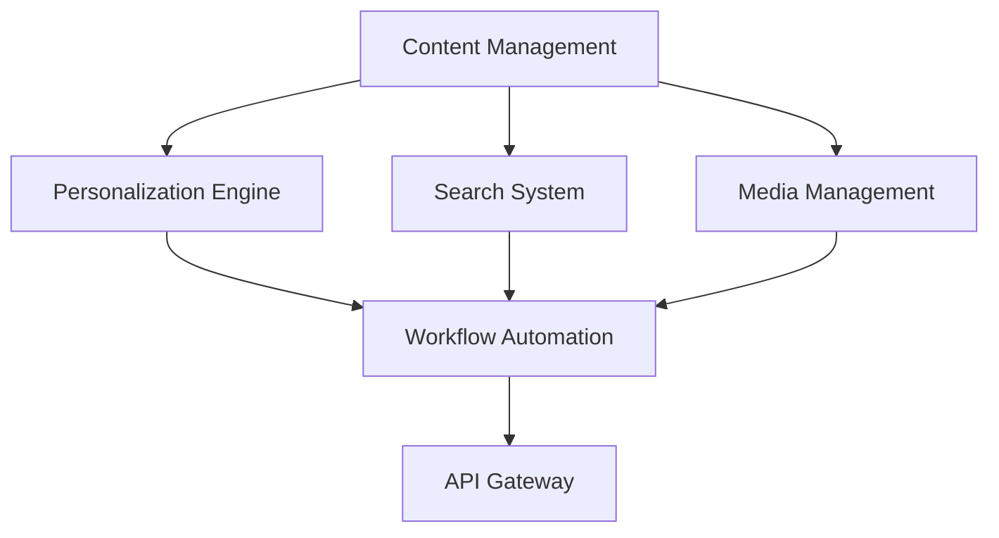

# CMS Integration Plan

## System Architecture

## Integration Components

1. **Content Management**
   - Core content storage and versioning
   - Content type definitions
   - Workflow integration points

2. **Personalization Engine**
   - User profile integration
   - Content recommendation API
   - Behavioral tracking

3. **Search System**
   - Indexing service
   - Search API
   - Faceted search configuration

4. **Media Management**
   - Asset storage
   - Transformation pipeline
   - Delivery optimization

5. **Workflow Automation**
   - Approval workflows
   - Notification system
   - Audit logging

## Performance Optimization

### Tiered Configuration

| Tier | Cache | DB Optimization | Queue Workers |
|------|-------|-----------------|---------------|
| Basic | File | Standard indexes | 1 worker |
| Pro | Redis | Composite indexes | 3 workers |
| Enterprise | Redis Cluster | Fulltext + Composite | 10 workers |

## Documentation Updates

1. **System Architecture**
   - Component interaction diagrams
   - API contracts
   - Event specifications

2. **Performance Guidelines**
   - Configuration per tier
   - Monitoring setup
   - Scaling recommendations

3. **Deployment Checklist**
   - Environment variables
   - Required services
   - Health checks

## Integration Tests

1. **End-to-End Workflows**
   - Content creation → Personalization → Delivery
   - Media upload → Transformation → Search indexing

2. **Performance Benchmarks**
   - Content delivery latency
   - Search query response times
   - Concurrent user capacity

3. **Stress Testing**
   - Peak load simulations
   - Failure recovery scenarios
   - Database failover tests