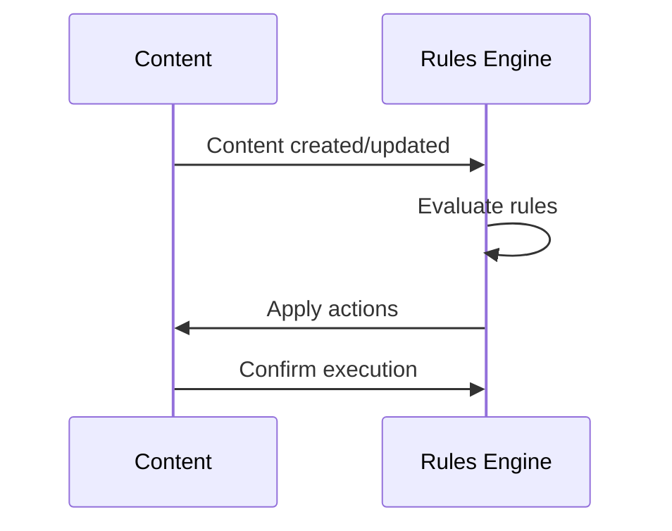

# Conditional Publishing Integration

## Workflow Integration

The conditional publishing system integrates with these core workflows:

1. **Content Approval**
   - Rules can trigger after editorial approval
   - Example: Auto-publish approved news articles

2. **Scheduled Publishing**  
   - Rules can specify future publish dates
   - Example: Publish seasonal content on specific dates

3. **Moderation Workflows**
   - Rules can enforce moderation requirements
   - Example: Legal review for sensitive categories

## Content Lifecycle Hooks

Integration points in the content lifecycle:



## Event System

Subscribe to these events:

- `ConditionalPublishing.RuleEvaluated`
  - Payload: `{ruleId, contentId, matched}`
- `ConditionalPublishing.ActionExecuted`  
  - Payload: `{ruleId, contentId, actionType}`

Example event listener:
```php
Event::listen('ConditionalPublishing.ActionExecuted', function ($payload) {
    Log::info("Rule {$payload['ruleId']} executed on content {$payload['contentId']}");
});
```

## API Integration

### Evaluating Rules Programmatically

```javascript
// Evaluate specific content against all rules
const response = await axios.post('/api/conditional-publishing/evaluate', {
  contentId: '123'  
});

// Result format
{
  matchedRules: [{
    id: 'rule-1',
    actions: ['publish']
  }],
  executedActions: ['publish']
}
```

### Creating Rules via API

```php
$response = Http::post('/api/conditional-publishing/rules', [
    'name' => 'Auto-publish News',
    'conditions' => [
        ['field' => 'category', 'operator' => 'equals', 'value' => 'news']
    ],
    'actions' => [
        ['type' => 'publish', 'value' => 'immediately']
    ]
]);
```

## Testing Integration

1. Use the test endpoint:
   `POST /api/conditional-publishing/test`
   - Simulates rule evaluation
   - Returns detailed matching information

2. Check integration logs:
   `GET /api/conditional-publishing/logs`
   - Shows recent evaluations
   - Includes error details