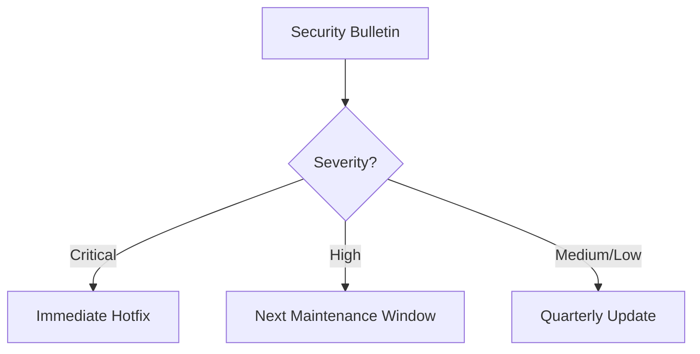

# CMS Maintenance Procedures

## Monitoring Setup
### Grafana Dashboards
- **Content Metrics**: `grafana/dashboards/content_metrics.json`
- **AI Usage**: `grafana/dashboards/ai_usage.json`
- **Moderation Workflows**: `grafana/dashboards/moderation.json`

### Alert Thresholds
```yaml
content_views:
  critical: <1000/day
  warning: <5000/day
ai_usage:
  critical: >1M tokens/day
moderation:
  critical: >100 pending/hour
```

## Alert Response Protocol
1. **Triage**:
   - Check dashboard for related metrics
   - Review recent deployments
2. **Escalation**:
   - P1: Notify on-call engineer immediately
   - P2: Create ticket for next business day
   - P3: Log for weekly review

## Patch Management


## Scheduled Maintenance
- **Daily**:
  - Database backups verification
  - Log rotation
- **Weekly**:
  - Metrics review
  - Pending updates audit
- **Monthly**:
  - Security patches
  - Capacity planning review

## Capacity Planning
- **Metrics to Monitor**:
  - Database growth rate
  - Storage utilization
  - API request trends
- **Scale Triggers**:
  - 80% resource utilization
  - 2x weekly peak traffic